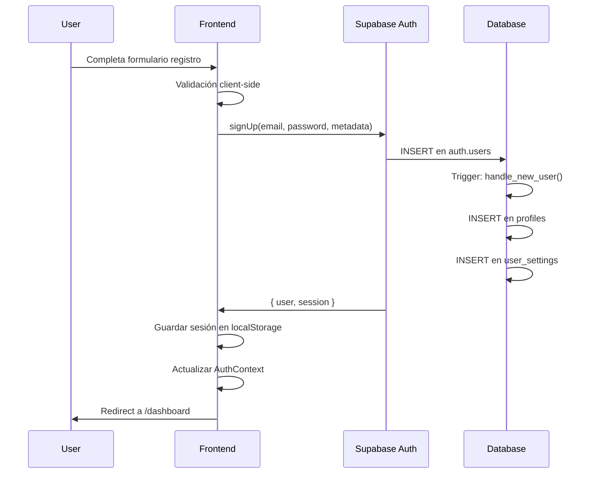
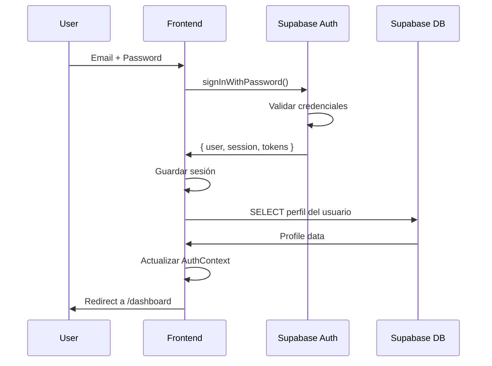
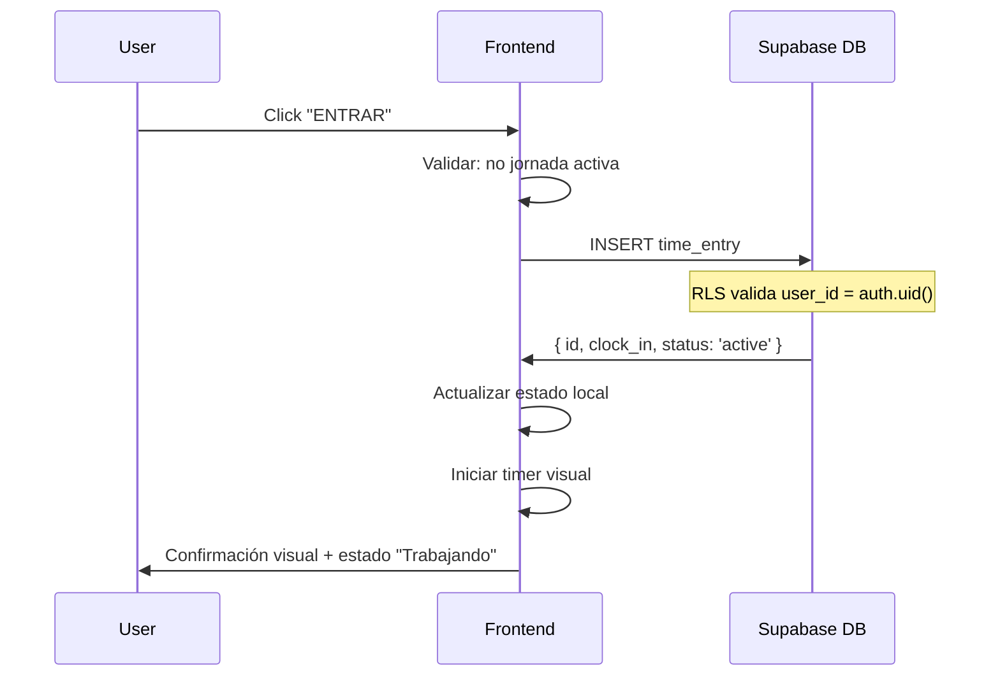
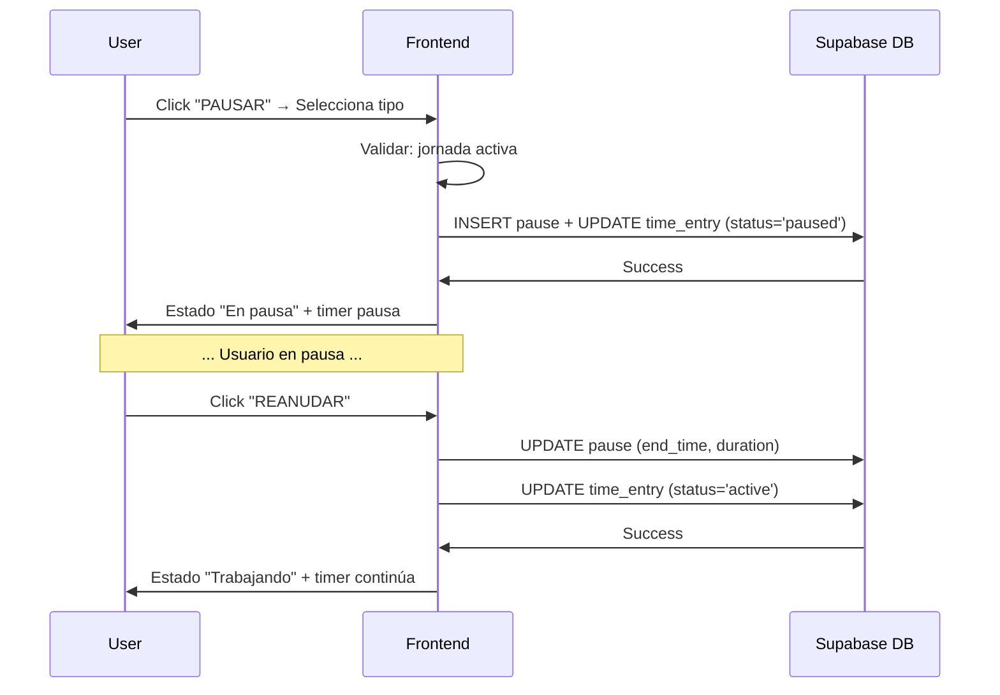
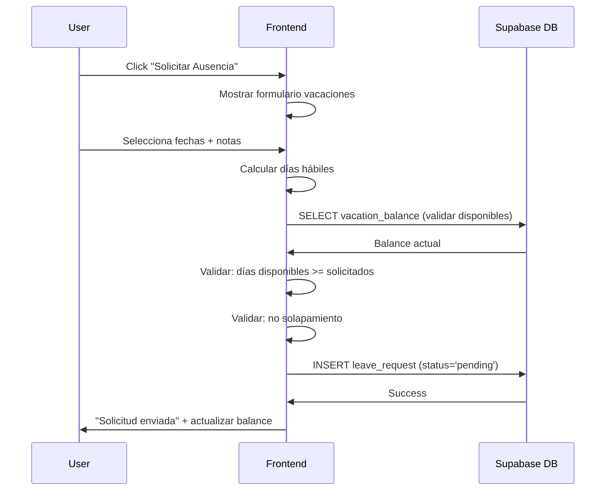
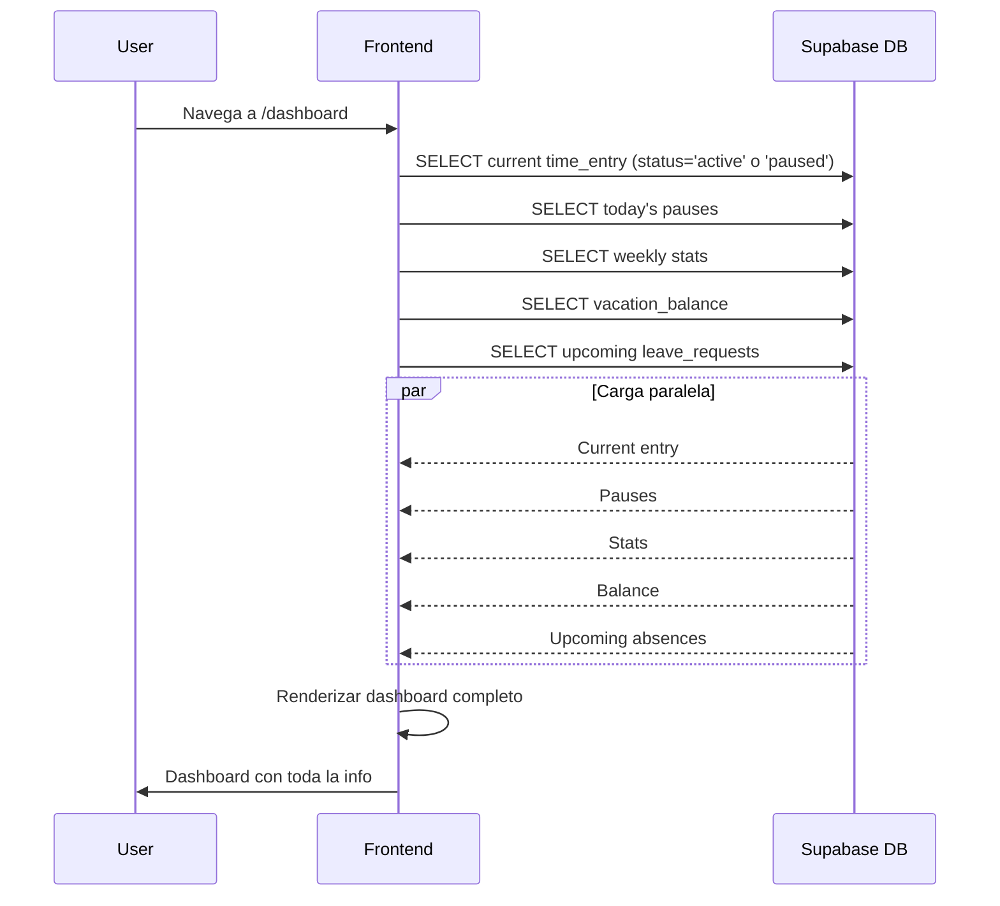

# Especificación Técnica Completa: Aplicación de Control Horario y Gestión de Ausencias

> **Versión 2.0** - Documentación completa y mejorada  
> **Última actualización:** Febrero 2026  
> **Principio guía:** Un usuario debe poder usar la app completamente **sin ninguna documentación o tutorial**

---

## 📋 ÍNDICE

1. [Visión General del Proyecto](#1-visión-general-del-proyecto)
2. [Requerimientos Funcionales](#2-requerimientos-funcionales)
3. [Requerimientos No Funcionales](#3-requerimientos-no-funcionales)
4. [Arquitectura Técnica](#4-arquitectura-técnica)
5. [Interfaz de Usuario](#5-interfaz-de-usuario)
6. [Lógica de Negocio](#6-lógica-de-negocio)
7. [Seguridad y Manejo de Errores](#7-seguridad-y-manejo-de-errores)
8. [Testing y Calidad](#8-testing-y-calidad)
9. [Despliegue y DevOps](#9-despliegue-y-devops)
10. [Mejoras Futuras](#10-mejoras-futuras)
11. [Criterios de Aceptación](#11-criterios-de-aceptación)
12. [Guía de Implementación](#12-guía-de-implementación)

---

## 1. VISIÓN GENERAL DEL PROYECTO

### 1.1 Descripción

Aplicación web moderna y **extremadamente intuitiva** para control horario y gestión de ausencias que permite a los usuarios:
- Registrar entradas/salidas (fichaje digital)
- Gestionar pausas durante la jornada
- Solicitar vacaciones y permisos
- Ver balance de días disponibles
- Generar reportes automáticos
- Visualizar estadísticas personales

**Filosofía de diseño:** "Mi abuela debería poder usarla sin ayuda"

### 1.2 Objetivos Principales

- **Simplicidad extrema:** Interfaz tan clara que no requiera explicación
- **Feedback inmediato:** Cada acción tiene respuesta visual instantánea
- **Cero fricción:** Mínimo número de clics para cualquier tarea
- **Mobile-first:** Diseñada primero para móvil, mejorada en desktop
- **Accesibilidad:** WCAG 2.1 AA como mínimo
- **Confiabilidad:** Los datos nunca se pierden

### 1.3 Alcance del MVP

#### ✅ Incluido en esta versión

**Control Horario:**
- Sistema de autenticación completo
- Registro de entrada/salida (check-in/check-out)
- Gestión de pausas con tipos (comida, descanso, otra)
- Cálculo automático de horas trabajadas
- Historial con vistas diaria/semanal/mensual
- Dashboard con estadísticas en tiempo real
- Edición y eliminación de registros propios
- Exportación a CSV

**Gestión de Ausencias (NUEVO):**
- Solicitud de vacaciones
- Solicitud de permisos (horas, medio día, día completo)
- Balance de días disponibles/consumidos
- Historial de solicitudes
- Estados: Pendiente, Aprobada, Rechazada
- Calendario visual de ausencias

**Seguridad:**
- Autenticación con Supabase Auth
- Row Level Security (RLS) en todas las tablas
- Datos privados por usuario
- Validación client-side y server-side

#### ❌ Fuera del alcance inicial

- Gestión multi-empresa/equipos
- Sistema de aprobaciones (supervisor/manager)
- Roles y permisos granulares
- Integración con nóminas
- Geolocalización
- OAuth/Social login (Google, GitHub)
- Notificaciones push
- App móvil nativa (es PWA)

---

## 2. REQUERIMIENTOS FUNCIONALES

### 2.1 Autenticación y Gestión de Usuarios

#### RF-001: Registro de Usuario
**Objetivo:** Permitir crear cuenta nueva de forma simple y rápida

**Flujo:**
1. Usuario accede a página de registro
2. Completa formulario minimalista:
   - Nombre completo
   - Email
   - Contraseña (con indicador de fortaleza visual)
   - Confirmar contraseña
3. Click en "Crear cuenta"
4. Sistema crea usuario y perfil automáticamente
5. Redirección automática al dashboard

**Validaciones:**
- Email válido (formato correcto)
- Email no registrado previamente
- Contraseña mínimo 8 caracteres
- Al menos 1 mayúscula, 1 minúscula, 1 número
- Contraseñas coinciden
- Nombre no vacío

**UX crítica:**
- Validación en tiempo real (sin esperar submit)
- Indicador visual de fortaleza de contraseña
- Mensajes de error específicos y útiles
- Auto-focus en primer campo
- Enter para enviar formulario

#### RF-002: Login de Usuario
**Objetivo:** Acceso rápido y sin fricciones

**Flujo:**
1. Email + contraseña
2. Opcional: "Recordarme" (mantener sesión 30 días)
3. Click "Iniciar sesión"
4. Redirección al dashboard

**Validaciones:**
- Credenciales correctas contra Supabase
- Cuenta no bloqueada (max 5 intentos fallidos)
- Email verificado (si se activó verificación)

**UX crítica:**
- Auto-completado de navegador habilitado
- Botón deshabilitado mientras valida
- Spinner/loading visual
- Mensaje de error genérico ("Credenciales incorrectas") por seguridad
- Link prominente a "¿Olvidaste tu contraseña?"

#### RF-003: Logout
**Objetivo:** Cerrar sesión de forma segura

**Flujo:**
1. Usuario click en avatar/menú usuario
2. Click "Cerrar sesión"
3. Si hay jornada activa: mostrar advertencia
4. Confirmación → limpia sesión → redirect a login

**UX crítica:**
- Icono de salida visible pero no invasivo
- Confirmación solo si hay jornada activa
- Mensaje amigable: "Tienes una jornada activa, ¿deseas finalizarla antes de salir?"

#### RF-004: Recuperación de Contraseña
**Objetivo:** Recuperar acceso de forma autónoma

**Flujo:**
1. Link "¿Olvidaste tu contraseña?" en login
2. Ingresar email
3. Sistema envía email con link temporal
4. Usuario click en link
5. Ingresa nueva contraseña
6. Confirmación y redirect a login

**UX crítica:**
- Email de recuperación con diseño profesional
- Link válido por 1 hora
- Mensaje claro cuando link expira
- Opción de reenviar link

#### RF-005: Perfil de Usuario
**Objetivo:** Gestionar información personal

**Funcionalidad:**
- Ver y editar nombre completo
- Ver email (no editable, es identificador único)
- Cambiar contraseña (requiere contraseña actual)
- Subir/cambiar avatar (opcional)
- Ver fecha de registro
- Ver configuración de días de vacaciones
- Eliminar cuenta (con doble confirmación)

**UX crítica:**
- Edición inline (sin modal)
- Botón "Guardar" solo activo si hay cambios
- Confirmación visual al guardar
- Doble confirmación para eliminar cuenta con texto específico

#### RF-006: Protección de Rutas
**Objetivo:** Seguridad de acceso

**Comportamiento:**
- Rutas públicas: `/login`, `/register`, `/forgot-password`, `/reset-password`
- Rutas privadas: todo lo demás
- Si no autenticado → redirect a `/login`
- Si autenticado → redirect desde login a `/dashboard`
- Preservar ruta destino para redirect post-login

---

### 2.2 Gestión de Jornada Laboral

#### RF-007: Iniciar Jornada
**Objetivo:** Registrar inicio de trabajo con un solo click

**Flujo:**
1. Usuario en dashboard ve botón grande "ENTRAR"
2. Click → captura timestamp automática
3. Animación de confirmación
4. Estado cambia a "Trabajando"
5. Timer visible comienza a correr

**Validaciones:**
- No debe haber otra jornada activa
- Timestamp no puede ser futuro
- Usuario autenticado

**UX crítica:**
- Botón ENORME y verde
- Icono de "play" o reloj
- Animación suave al presionar
- Confirmación visual inmediata (checkmark, color)
- Timer visible mostrando tiempo transcurrido
- Hora de entrada mostrada claramente

#### RF-008: Finalizar Jornada
**Objetivo:** Registrar fin de trabajo y calcular horas

**Flujo:**
1. Usuario ve botón grande "SALIR"
2. Click → captura timestamp
3. Cálculo automático de horas trabajadas (descontando pausas)
4. Mostrar resumen: "Trabajaste 8h 23min hoy"
5. Estado cambia a "Fuera de jornada"

**Validaciones:**
- Debe haber jornada activa
- Si hay pausa activa: advertir "Tienes pausa activa, ¿finalizarla también?"
- Timestamp posterior a entrada

**UX crítica:**
- Botón ENORME y rojo
- Icono de "stop" o logout
- Modal de confirmación con resumen visual
- Mostrar: hora entrada, hora salida, pausas, total neto
- Gráfico circular o barra visual del tiempo

#### RF-009: Gestión de Pausas
**Objetivo:** Registrar descansos durante jornada

**Tipos de pausa:**
- 🍽️ Comida (sugerido: 30-60 min)
- ☕ Descanso (sugerido: 10-15 min)
- 🔧 Otra (personalizable)

**Flujo iniciar pausa:**
1. Durante jornada activa, botón "PAUSAR" visible
2. Click → selector de tipo de pausa
3. Seleccionar tipo → timestamp automático
4. Estado cambia a "En pausa"
5. Timer de pausa comienza

**Flujo reanudar:**
1. Botón "REANUDAR" visible durante pausa
2. Click → timestamp de fin de pausa
3. Cálculo duración pausa
4. Estado vuelve a "Trabajando"
5. Timer de trabajo continúa

**Validaciones:**
- Solo durante jornada activa
- No múltiples pausas simultáneas
- Duración mínima: 1 minuto

**UX crítica:**
- Botones de pausa diferenciados por color (amarillo/naranja)
- Iconos claros por tipo de pausa
- Sugerencias de duración típica
- Timer de pausa visible y diferenciado
- Historial de pausas del día visible
- Animación suave entre estados

#### RF-010: Validaciones del Sistema
**Reglas de negocio:**

- ❌ No permitir "Salir" sin "Entrar" previo
- ❌ No permitir múltiples entradas simultáneas
- ❌ No permitir pausas sin jornada activa
- ❌ No editar/eliminar registros de otros usuarios
- ❌ No modificar jornada activa de otro día
- ✅ Permitir editar registros propios del pasado
- ✅ Permitir cancelar pausa y jornada errónea inmediatamente

---

### 2.3 Gestión de Ausencias (NUEVO)

#### RF-011: Solicitud de Vacaciones
**Objetivo:** Solicitar días de vacaciones de forma simple

**Flujo:**
1. Usuario click en "Solicitar Ausencia"
2. Selecciona tipo: "Vacaciones"
3. Selector de rango de fechas (calendario visual)
4. Sistema muestra:
   - Días solicitados (automático según rango)
   - Días disponibles vs. solicitados
   - Advertencia si incluye fines de semana/festivos
5. Campo opcional: "Notas"
6. Click "Solicitar"
7. Sistema crea solicitud con estado "Pendiente"
8. Confirmación visual: "Solicitud enviada"

**Validaciones:**
- Fecha inicio ≤ fecha fin
- No fechas pasadas (excepto justificaciones)
- No superar días disponibles
- No solapamiento con vacaciones ya aprobadas
- Verificar días hábiles vs. totales

**UX crítica:**
- Calendario visual grande y claro
- Selector de rango intuitivo (click inicio, click fin)
- Indicador visual de días ya ocupados
- Cálculo automático de días (excluyendo fines de semana)
- Balance visible todo el tiempo: "Te quedan 15 de 22 días"
- Advertencias proactivas: "Incluye 2 fines de semana (no contabilizan)"
- Confirmación con resumen antes de enviar

#### RF-012: Solicitud de Permisos
**Objetivo:** Solicitar ausencias cortas (horas, medio día, día completo)

**Tipos de permiso:**
- ⏰ Por horas (ej: cita médica 2h)
- 🌅 Medio día (mañana o tarde)
- 📅 Día completo
- 🏥 Médico (puede requerir justificante)
- 👤 Personal
- 📚 Formación
- 🔧 Otro

**Flujo:**
1. Usuario click "Solicitar Ausencia"
2. Selecciona tipo: "Permiso"
3. Selecciona duración: Horas / Medio día / Día completo
4. **Si horas:** selector de fecha + hora inicio + hora fin
5. **Si medio día:** fecha + mañana o tarde
6. **Si día completo:** fecha
7. Selecciona motivo (desplegable)
8. Campo opcional: Notas
9. Opcional: Adjuntar archivo (justificante médico)
10. Click "Solicitar"

**Validaciones:**
- Fechas/horas válidas
- Si horas: dentro de jornada laboral
- Hora fin > hora inicio
- No solapamiento con otros permisos aprobados

**UX crítica:**
- Formulario dinámico (campos cambian según duración)
- Selector de horario tipo "reloj" o dropdown cada 30min
- Preview visual: "Permiso el 15/03/2026 de 09:00 a 11:00 (2 horas)"
- Opción de arrastrar/soltar archivo justificante
- Indicador de "recomendado adjuntar justificante" para médicos
- Confirmación clara del impacto: "Este permiso NO descuenta de vacaciones"

#### RF-013: Balance de Días
**Objetivo:** Transparencia total sobre días disponibles

**Información visible:**
- 📊 Total días vacaciones al año (ej: 22 días)
- ✅ Días consumidos (ej: 7 días)
- 📅 Días disponibles (ej: 15 días)
- ⏳ Días pendientes de aprobación (ej: 5 días)
- 📈 Gráfico visual (barra de progreso)

**Cálculo:**
```
Disponibles = Total anual - Consumidos - Pendientes
Consumidos = Solo solicitudes APROBADAS del año actual
Pendientes = Solicitudes en estado PENDIENTE
```

**UX crítica:**
- Widget siempre visible en dashboard
- Barra de progreso colorizada:
  - Verde: >50% disponible
  - Amarillo: 25-50% disponible
  - Rojo: <25% disponible
- Tooltip explicativo al hover
- Link a historial completo

#### RF-014: Historial de Solicitudes
**Objetivo:** Transparencia y trazabilidad

**Vista:**
- Lista de todas las solicitudes ordenadas por fecha
- Filtros: Tipo, Estado, Rango fechas
- Cada tarjeta muestra:
  - Tipo y duración
  - Fechas
  - Estado (badge colorizado)
  - Notas si existen
  - Fecha de solicitud
  - Acciones: Ver detalle, Cancelar (si pendiente)

**Estados y colores:**
- 🟡 **Pendiente:** Amarillo (puede cancelar)
- 🟢 **Aprobada:** Verde (solo visualización)
- 🔴 **Rechazada:** Rojo (con motivo de rechazo)
- ⚪ **Cancelada:** Gris

**UX crítica:**
- Vista de tarjetas responsive
- Badges grandes y claros
- Filtros accesibles sin scroll
- Paginación si >20 elementos
- Botón "Cancelar" solo en pendientes
- Confirmación antes de cancelar

#### RF-015: Calendario de Ausencias
**Objetivo:** Visualización rápida de ausencias programadas

**Funcionalidad:**
- Vista mensual tipo calendario
- Días marcados según tipo:
  - 🏖️ Vacaciones: azul
  - ⏰ Permisos: naranja
  - 🏥 Bajas médicas: rojo (futuro)
  - 🎉 Festivos: gris claro
- Click en día → detalle de ausencia
- Navegación mes anterior/siguiente
- Vista año completo (opcional)

**UX crítica:**
- Calendario grande y legible
- Colores diferenciados claramente
- Leyenda visible todo el tiempo
- Responsive: en móvil, semana por semana
- Hover en desktop muestra tooltip con detalle
- Solo mostrar datos del usuario (privacidad)

---

### 2.4 Visualización y Reportes

#### RF-016: Dashboard Principal
**Objetivo:** Información crítica de un vistazo

**Secciones (orden de prioridad visual):**

1. **Estado actual (MUY GRANDE):**
   - "Trabajando" / "En pausa" / "Fuera de jornada"
   - Timer en tiempo real
   - Botones de acción principales

2. **Balance de vacaciones (destacado):**
   - Widget con días disponibles
   - Gráfico circular o barra
   - Link "Solicitar vacaciones"

3. **Resumen del día:**
   - Hora de entrada
   - Pausas tomadas (con duración)
   - Tiempo trabajado hoy
   - Gráfico de distribución

4. **Estadísticas rápidas:**
   - Horas esta semana
   - Horas este mes
   - Promedio diario

5. **Próximas ausencias:**
   - Lista de próximas 3 ausencias aprobadas
   - Link a calendario completo

6. **Accesos rápidos:**
   - Solicitar ausencia
   - Ver historial
   - Exportar datos

**UX crítica:**
- Diseño tipo "cards" con jerarquía clara
- Mobile: una columna, orden prioritario
- Desktop: 2-3 columnas, grid responsive
- Animaciones suaves entre estados
- Auto-refresh cada 30 segundos
- Skeleton screens mientras carga

#### RF-017: Historial de Registros
**Objetivo:** Auditoría completa de tiempo trabajado

**Vista:**
- Calendario mensual compacto
- Lista cronológica inversa (más reciente primero)
- Filtros: Día, Semana, Mes, Rango personalizado
- Cada registro muestra:
  - Fecha
  - Hora entrada - hora salida
  - Duración total
  - Pausas (con desglose)
  - Icono si editado manualmente
  - Acciones: Editar, Eliminar

**Agrupación:**
- Por semana: Lunes a Domingo con total semanal
- Por mes: Cada día con total mensual
- Resaltado de fines de semana

**UX crítica:**
- Tarjetas expandibles (click para ver pausas)
- Iconos claros (reloj, pausa, editar)
- Indicador visual si registro editado
- Totales destacados y sumados automáticamente
- Búsqueda rápida por fecha
- Export visible y accesible

#### RF-018: Estadísticas
**Objetivo:** Insights sobre patrones de trabajo

**Métricas:**
- Total horas trabajadas (semana/mes/año)
- Promedio horas diarias
- Días trabajados vs. días hábiles
- Pausas promedio por día
- Distribución horaria (entrada/salida típica)

**Gráficos:**
1. **Barras:** Horas por día de la semana
2. **Líneas:** Tendencia mensual
3. **Circular:** Distribución de pausas por tipo
4. **Heatmap:** Días trabajados en el año

**UX crítica:**
- Gráficos interactivos (hover para detalle)
- Selector de período visible
- Colores consistentes con el resto de la app
- Tooltip explicativo en cada métrica
- Opción de comparar períodos
- Responsive: gráficos se adaptan a pantalla

#### RF-019: Exportación
**Objetivo:** Datos portables para otros sistemas

**Formatos:**
- CSV (para Excel/Google Sheets)
- PDF (reporte visual con gráficos) [Fase 2]

**Contenido CSV:**
```csv
Fecha,Entrada,Salida,Pausas,Horas Trabajadas,Editado,Notas
2026-02-14,09:00,18:30,01:00,8.5,No,
2026-02-13,09:15,17:45,00:45,8.0,Sí,Ajuste manual
```

**Flujo:**
1. Usuario selecciona rango de fechas
2. Click "Exportar a CSV"
3. Descarga automática
4. Confirmación: "Datos exportados: 23 registros"

**UX crítica:**
- Preview de primeras filas antes de exportar
- Nombre de archivo automático: `registro_horario_usuario_2026-01-01_2026-01-31.csv`
- Contador de registros a exportar
- Opción de incluir/excluir encabezados
- Botón grande y claro

---

### 2.5 Edición y Gestión

#### RF-020: Editar Registros
**Objetivo:** Corrección de errores o ajustes manuales

**Casos de uso:**
- Olvidé fichar entrada/salida
- Hora incorrecta por error
- Agregar/modificar pausas olvidadas

**Flujo:**
1. En historial, click "Editar" en registro
2. Modal con formulario:
   - Fecha (solo visual, no editable)
   - Hora entrada (editable)
   - Hora salida (editable)
   - Pausas (lista editable: agregar, modificar, eliminar)
   - Campo "Motivo del ajuste" (opcional)
3. Validaciones en tiempo real
4. Click "Guardar cambios"
5. Registro marcado como "Editado manualmente"

**Validaciones:**
- Solo registros propios
- Solo registros pasados (no jornada activa)
- Hora salida > hora entrada
- Pausas dentro del rango de jornada
- Total pausas < total jornada

**UX crítica:**
- Modal grande con selectores de hora claros
- Cálculo en tiempo real de horas totales
- Advertencias si valores atípicos (ej: >12h)
- Diferenciación visual: antes vs. después
- Confirmación con resumen de cambios
- Icono de "editado" permanente en registro

#### RF-021: Eliminar Registros
**Objetivo:** Borrar registros erróneos

**Restricciones:**
- Solo registros propios
- No jornada activa del día actual
- Confirmación doble

**Flujo:**
1. Click "Eliminar" en registro
2. Modal de confirmación:
   - "¿Eliminar registro del 14/02/2026?"
   - "Esta acción NO se puede deshacer"
   - Mostrar detalle del registro
3. Botón "Cancelar" (grande) vs "Eliminar" (más pequeño, rojo)
4. Si confirma → eliminación + toast "Registro eliminado"

**UX crítica:**
- Confirmación clara del impacto
- Botón de eliminar menos prominente que cancelar
- Color rojo para acción destructiva
- Opción de deshacer (snackbar con "Deshacer" 5 segundos)
- No permitir eliminar si referenciado en nóminas [futuro]

---

## 3. REQUERIMIENTOS NO FUNCIONALES

### 3.1 Usabilidad (Prioridad MÁXIMA)

**RNF-001: Facilidad de Uso Extrema**
- Cualquier usuario puede usar la app sin tutorial
- Máximo 3 clicks para cualquier tarea común
- Feedback visual en <100ms
- Términos en lenguaje natural (evitar jerga técnica)
- Mensajes de error constructivos con solución

**RNF-002: Accesibilidad (WCAG 2.1 AA)**
- Contraste mínimo 4.5:1 en textos
- Todos los elementos interactivos con mínimo 44x44px
- Navegación completa por teclado (Tab, Enter, Esc)
- Screen reader compatible (ARIA labels)
- Sin dependencia exclusiva de color
- Textos alternativos en imágenes/iconos

**RNF-003: Responsive Design**
- Mobile first (320px mínimo)
- Breakpoints: 640px (tablet), 1024px (desktop)
- Touch targets mínimo 44x44px
- Gestos intuitivos (swipe, pinch, tap)
- Orientación portrait y landscape

**RNF-004: Internacionalización (i18n)**
- Soporte multi-idioma [Fase 2]
- Formato de fechas según locale
- Formato de horas: 24h (Europa) o 12h AM/PM (USA)
- Separadores decimales según región

---

### 3.2 Rendimiento

**RNF-005: Tiempos de Carga**
- First Contentful Paint (FCP): <1.5s
- Time to Interactive (TTI): <3s
- Largest Contentful Paint (LCP): <2.5s
- Cumulative Layout Shift (CLS): <0.1

**RNF-006: Tiempos de Respuesta**
- Acciones del usuario: <200ms feedback visual
- Consultas a Supabase: <500ms
- Carga de dashboard: <1s
- Exportación CSV: <2s (hasta 1000 registros)

**RNF-007: Optimización**
- Code splitting por rutas
- Lazy loading de componentes pesados
- Imágenes optimizadas (WebP con fallback)
- Caché estratégico de datos
- Virtualización de listas largas (>50 items)

**RNF-008: Offline First (PWA)**
- Service Worker para caché
- Funcionalidad básica offline:
  - Ver dashboard actual
  - Ver historial cargado
  - Registrar entrada/salida (sincroniza al conectar)
- Indicador de estado online/offline
- Cola de sincronización visible

---

### 3.3 Confiabilidad

**RNF-009: Disponibilidad**
- Uptime objetivo: 99.5% (máximo 3.6h down/mes)
- Degradación elegante si Supabase falla
- Mensajes claros de estado del sistema

**RNF-010: Persistencia de Datos**
- Transacciones atómicas (todo o nada)
- Backup automático diario en Supabase
- Retención de datos: mínimo 2 años
- No pérdida de datos ante cierre inesperado

**RNF-011: Validación Robusta**
- Validación client-side (UX rápida)
- Validación server-side (seguridad)
- Sanitización de inputs
- Manejo de errores graceful

---

### 3.4 Seguridad

**RNF-012: Autenticación**
- Contraseñas hasheadas con bcrypt (Supabase)
- Sesiones con JWT + refresh tokens
- Expiración de sesión: 30 días (con "recordarme")
- Máximo 5 intentos login fallidos → bloqueo 15 min

**RNF-013: Autorización**
- Row Level Security (RLS) en TODAS las tablas
- Políticas a nivel de base de datos
- Validación de permisos en cada operación
- Principio de mínimo privilegio

**RNF-014: Protección de Datos**
- HTTPS obligatorio en producción
- Headers de seguridad (CSP, HSTS, X-Frame-Options)
- CORS configurado restrictivamente
- Sanitización contra XSS
- Protección SQL injection (Supabase ORM)

**RNF-015: Privacidad**
- Datos personales solo visibles por el propietario
- No compartir datos entre usuarios
- Cumplimiento RGPD:
  - Derecho al olvido (eliminar cuenta)
  - Exportación de datos personales
  - Consentimiento explícito
- Logs anonimizados

**RNF-016: Auditoría**
- Log de acciones críticas:
  - Login/logout
  - Cambios en registros horarios
  - Solicitudes de ausencias
  - Cambios de contraseña
- Retención de logs: 90 días
- Timestamps precisos (UTC)

---

### 3.5 Compatibilidad

**RNF-017: Navegadores**
- Chrome/Edge: últimas 2 versiones
- Firefox: últimas 2 versiones
- Safari: últimas 2 versiones (iOS y macOS)
- No soporte: IE11 (EOL)

**RNF-018: Dispositivos**
- iOS: 14+
- Android: 10+
- Desktop: Windows 10+, macOS 11+

**RNF-019: PWA (Progressive Web App)**
- Instalable en home screen
- Icono y splash screen personalizados
- Funciona como app nativa
- Notificaciones web (opcional) [Fase 2]

---

### 3.6 Mantenibilidad

**RNF-020: Código**
- TypeScript estricto (no `any`)
- ESLint + Prettier configurados
- Componentes reutilizables <200 líneas
- Funciones puras cuando sea posible
- Testing: >80% cobertura [objetivo]

**RNF-021: Documentación**
- README completo con setup
- Comentarios en lógica compleja
- Storybook para componentes UI [opcional]
- Documentación de API (types generados)

**RNF-022: Versionado**
- Git flow: main, develop, feature/*
- Semantic versioning (MAJOR.MINOR.PATCH)
- Changelog actualizado
- Tags en releases

---

## 4. ARQUITECTURA TÉCNICA

### 4.1 Stack Tecnológico

#### Frontend
```yaml
Core:
  - React: 18.3+
  - TypeScript: 5.3+
  - Vite: 5.0+ (build tool)

Estilos:
  - Tailwind CSS: 3.4+
  - shadcn/ui: Componentes base
  - Radix UI: Primitivos accesibles
  - Lucide React: Iconografía

Gestión de Estado:
  - React Context + Hooks (estado global)
  - TanStack Query (v5): Caché y sincronización
  - Zustand: Estado UI opcional

Formularios y Validación:
  - React Hook Form: Gestión de formularios
  - Zod: Validación de esquemas

Utilidades:
  - date-fns: Manipulación de fechas
  - React Router DOM v6: Navegación
  - Recharts: Gráficos y estadísticas
  - papaparse: Exportación CSV
```

#### Backend (BaaS)
```yaml
Supabase:
  - Auth: Autenticación JWT
  - Database: PostgreSQL 15+
  - Storage: Archivos (justificantes) [Fase 2]
  - Realtime: Subscripciones [Fase 2]
  - Edge Functions: Lógica serverless [Fase 2]

Seguridad:
  - Row Level Security (RLS): Habilitado
  - Políticas de acceso: Por usuario
```

#### DevOps
```yaml
Control de Versiones:
  - Git + GitHub

CI/CD:
  - GitHub Actions
  - Tests automáticos pre-deploy
  - Lint y type checking

Hosting:
  - Frontend: Vercel / Netlify
  - Backend: Supabase Cloud
  - CDN: Automático (Vercel/Netlify)

Monitoreo:
  - Sentry: Error tracking
  - Vercel Analytics: Performance
  - Supabase Dashboard: DB monitoring
```

---

### 4.2 Arquitectura de Componentes

```
src/
├── components/
│   ├── auth/
│   │   ├── LoginForm.tsx
│   │   ├── RegisterForm.tsx
│   │   ├── ForgotPasswordForm.tsx
│   │   ├── ResetPasswordForm.tsx
│   │   ├── ProtectedRoute.tsx
│   │   └── AuthGuard.tsx
│   │
│   ├── layout/
│   │   ├── AppLayout.tsx
│   │   ├── Header.tsx
│   │   ├── Sidebar.tsx (desktop)
│   │   ├── BottomNav.tsx (mobile)
│   │   ├── UserMenu.tsx
│   │   └── NotificationBell.tsx
│   │
│   ├── time-tracking/
│   │   ├── ClockControls.tsx          # Botones principales
│   │   ├── CurrentStatus.tsx          # Estado actual con timer
│   │   ├── PauseManager.tsx           # Gestión de pausas
│   │   ├── QuickActions.tsx           # Acciones rápidas
│   │   └── DaySummary.tsx             # Resumen del día
│   │
│   ├── leave-management/              # NUEVO
│   │   ├── LeaveRequestForm.tsx       # Formulario solicitud
│   │   ├── LeaveRequestCard.tsx       # Tarjeta de solicitud
│   │   ├── LeaveRequestList.tsx       # Lista filtrable
│   │   ├── LeaveCalendar.tsx          # Calendario visual
│   │   ├── VacationBalance.tsx        # Widget balance
│   │   ├── LeaveTypeSelector.tsx      # Selector tipo
│   │   └── LeaveStatusBadge.tsx       # Badge de estado
│   │
│   ├── history/
│   │   ├── TimeEntryList.tsx
│   │   ├── TimeEntryCard.tsx
│   │   ├── TimeEntryEditor.tsx        # Modal edición
│   │   ├── CalendarView.tsx
│   │   └── WeeklyView.tsx
│   │
│   ├── dashboard/
│   │   ├── DashboardGrid.tsx
│   │   ├── StatsCard.tsx
│   │   ├── WeeklyChart.tsx
│   │   ├── MonthlyChart.tsx
│   │   ├── UpcomingLeave.tsx          # NUEVO: próximas ausencias
│   │   └── QuickStats.tsx
│   │
│   ├── reports/
│   │   ├── ExportButton.tsx
│   │   ├── ReportFilters.tsx
│   │   ├── ReportPreview.tsx
│   │   └── StatsCharts.tsx
│   │
│   ├── profile/
│   │   ├── ProfileView.tsx
│   │   ├── ProfileEditor.tsx
│   │   ├── AvatarUploader.tsx
│   │   ├── PasswordChanger.tsx
│   │   ├── LeaveSettings.tsx          # NUEVO: config vacaciones
│   │   └── DeleteAccount.tsx
│   │
│   └── ui/                             # shadcn/ui components
│       ├── button.tsx
│       ├── card.tsx
│       ├── dialog.tsx
│       ├── input.tsx
│       ├── select.tsx
│       ├── calendar.tsx               # NUEVO
│       ├── badge.tsx
│       ├── toast.tsx
│       ├── skeleton.tsx
│       └── ... (otros componentes shadcn)
│
├── hooks/
│   ├── auth/
│   │   ├── useAuth.ts
│   │   ├── useLogin.ts
│   │   ├── useLogout.ts
│   │   └── useSession.ts
│   │
│   ├── time-tracking/
│   │   ├── useTimeTracking.ts
│   │   ├── useClockIn.ts
│   │   ├── useClockOut.ts
│   │   ├── usePause.ts
│   │   └── useTimeEntries.ts
│   │
│   ├── leave/                          # NUEVO
│   │   ├── useLeaveRequests.ts
│   │   ├── useVacationBalance.ts
│   │   ├── useCreateLeaveRequest.ts
│   │   ├── useCancelLeaveRequest.ts
│   │   └── useLeaveCalendar.ts
│   │
│   ├── stats/
│   │   ├── useStats.ts
│   │   ├── useWeeklyStats.ts
│   │   └── useMonthlyStats.ts
│   │
│   └── common/
│       ├── useSupabase.ts
│       ├── useToast.ts
│       └── useMediaQuery.ts
│
├── lib/
│   ├── supabase/
│   │   ├── client.ts                  # Cliente configurado
│   │   ├── auth.ts                    # Helpers auth
│   │   ├── database.types.ts          # Types generados
│   │   └── queries.ts                 # Queries reutilizables
│   │
│   ├── utils/
│   │   ├── date.ts                    # Utilidades de fechas
│   │   ├── calculations.ts            # Cálculos de tiempo
│   │   ├── validation.ts              # Validadores Zod
│   │   ├── formatting.ts              # Formateo de datos
│   │   └── export.ts                  # Exportación CSV
│   │
│   └── constants/
│       ├── routes.ts
│       ├── queryKeys.ts               # React Query keys
│       └── config.ts
│
├── types/
│   ├── auth.ts
│   ├── timeEntry.ts
│   ├── leave.ts                       # NUEVO
│   ├── stats.ts
│   └── index.ts
│
├── contexts/
│   ├── AuthContext.tsx
│   ├── ThemeContext.tsx               # Light/Dark mode
│   └── ToastContext.tsx
│
├── pages/
│   ├── auth/
│   │   ├── LoginPage.tsx
│   │   ├── RegisterPage.tsx
│   │   ├── ForgotPasswordPage.tsx
│   │   └── ResetPasswordPage.tsx
│   │
│   ├── DashboardPage.tsx
│   ├── HistoryPage.tsx
│   ├── LeavePage.tsx                  # NUEVO: gestión ausencias
│   ├── LeaveRequestPage.tsx           # NUEVO: nueva solicitud
│   ├── ReportsPage.tsx
│   ├── ProfilePage.tsx
│   └── NotFoundPage.tsx
│
├── App.tsx
├── main.tsx
└── routes.tsx
```

---

### 4.3 Modelo de Datos

#### Tablas de Supabase

```typescript
// ============================================
// TABLA: profiles
// ============================================
interface Profile {
  id: string;                 // UUID, FK a auth.users.id
  full_name: string;
  avatar_url: string | null;
  created_at: Date;
  updated_at: Date;
}

// ============================================
// TABLA: user_settings (NUEVO)
// ============================================
interface UserSettings {
  id: string;                          // UUID, FK a auth.users.id
  vacation_days_per_year: number;      // Default: 22 días
  vacation_days_used: number;          // Calculado automáticamente
  contract_start_date: Date | null;
  work_schedule: {                     // JSON
    monday: { start: string; end: string; };
    tuesday: { start: string; end: string; };
    wednesday: { start: string; end: string; };
    thursday: { start: string; end: string; };
    friday: { start: string; end: string; };
    saturday: null;
    sunday: null;
  };
  created_at: Date;
  updated_at: Date;
}

// ============================================
// TABLA: time_entries
// ============================================
interface TimeEntry {
  id: string;                          // UUID
  user_id: string;                     // FK a auth.users.id
  date: Date;                          // Fecha de la jornada
  clock_in: Date;                      // Timestamp entrada
  clock_out: Date | null;              // Timestamp salida (null si activa)
  total_hours: number | null;          // Calculado al finalizar
  status: 'active' | 'paused' | 'completed';
  edited_manually: boolean;            // Flag si fue editado
  notes: string | null;                // Notas opcionales
  created_at: Date;
  updated_at: Date;
}

// ============================================
// TABLA: pauses
// ============================================
interface Pause {
  id: string;                          // UUID
  time_entry_id: string;               // FK a time_entries.id
  start_time: Date;
  end_time: Date | null;               // null si pausa activa
  type: 'meal' | 'break' | 'other';
  duration: number | null;             // Minutos, calculado al finalizar
  created_at: Date;
  updated_at: Date;
}

// ============================================
// TABLA: leave_requests (NUEVO)
// ============================================
interface LeaveRequest {
  id: string;                                              // UUID
  user_id: string;                                         // FK a auth.users.id
  type: 'vacation' | 'sick_leave' | 'personal' | 'training' | 'other';
  duration: 'full_day' | 'half_day' | 'hours';
  start_date: Date;
  end_date: Date;
  start_time: string | null;                               // HH:MM para permisos por horas
  end_time: string | null;                                 // HH:MM
  total_days: number;                                      // 1.0, 0.5, etc.
  reason: string | null;                                   // Motivo/notas
  status: 'pending' | 'approved' | 'rejected' | 'cancelled';
  reviewed_at: Date | null;
  reviewed_by: string | null;                              // Futuro: FK a users
  rejection_reason: string | null;
  attachment_url: string | null;                           // URL a Storage [Fase 2]
  created_at: Date;
  updated_at: Date;
}

// ============================================
// VISTA: daily_stats (calculada)
// ============================================
interface DailyStats {
  user_id: string;
  date: Date;
  total_worked: number;                // Horas
  total_paused: number;                // Horas
  entries_count: number;
  first_clock_in: Date;
  last_clock_out: Date;
}

// ============================================
// VISTA: vacation_balance (calculada)
// ============================================
interface VacationBalance {
  user_id: string;
  year: number;
  total_days: number;                  // De user_settings
  used_days: number;                   // Aprobadas
  pending_days: number;                // Pendientes
  available_days: number;              // Total - usado - pendiente
}
```

---

### 4.4 Esquema SQL de Base de Datos

```sql
-- ============================================
-- EXTENSIONES
-- ============================================
CREATE EXTENSION IF NOT EXISTS "uuid-ossp";
CREATE EXTENSION IF NOT EXISTS "pg_stat_statements";

-- ============================================
-- TABLA: profiles
-- ============================================
CREATE TABLE profiles (
  id UUID REFERENCES auth.users(id) ON DELETE CASCADE PRIMARY KEY,
  full_name TEXT NOT NULL,
  avatar_url TEXT,
  created_at TIMESTAMPTZ DEFAULT NOW() NOT NULL,
  updated_at TIMESTAMPTZ DEFAULT NOW() NOT NULL
);

COMMENT ON TABLE profiles IS 'Perfiles de usuario extendidos';

-- ============================================
-- TABLA: user_settings (NUEVO)
-- ============================================
CREATE TABLE user_settings (
  id UUID REFERENCES auth.users(id) ON DELETE CASCADE PRIMARY KEY,
  vacation_days_per_year INTEGER DEFAULT 22 NOT NULL,
  vacation_days_used DECIMAL(4,1) DEFAULT 0 NOT NULL,
  contract_start_date DATE,
  work_schedule JSONB DEFAULT '{
    "monday": {"start": "09:00", "end": "18:00"},
    "tuesday": {"start": "09:00", "end": "18:00"},
    "wednesday": {"start": "09:00", "end": "18:00"},
    "thursday": {"start": "09:00", "end": "18:00"},
    "friday": {"start": "09:00", "end": "18:00"},
    "saturday": null,
    "sunday": null
  }'::jsonb,
  created_at TIMESTAMPTZ DEFAULT NOW() NOT NULL,
  updated_at TIMESTAMPTZ DEFAULT NOW() NOT NULL,
  
  CONSTRAINT valid_vacation_days CHECK (vacation_days_per_year >= 0 AND vacation_days_per_year <= 50),
  CONSTRAINT valid_days_used CHECK (vacation_days_used >= 0)
);

COMMENT ON TABLE user_settings IS 'Configuración de usuario para gestión de vacaciones y horarios';

-- ============================================
-- TABLA: time_entries
-- ============================================
CREATE TABLE time_entries (
  id UUID DEFAULT uuid_generate_v4() PRIMARY KEY,
  user_id UUID REFERENCES auth.users(id) ON DELETE CASCADE NOT NULL,
  date DATE NOT NULL,
  clock_in TIMESTAMPTZ NOT NULL,
  clock_out TIMESTAMPTZ,
  total_hours DECIMAL(5,2),
  status TEXT NOT NULL DEFAULT 'active',
  edited_manually BOOLEAN DEFAULT FALSE NOT NULL,
  notes TEXT,
  created_at TIMESTAMPTZ DEFAULT NOW() NOT NULL,
  updated_at TIMESTAMPTZ DEFAULT NOW() NOT NULL,
  
  CONSTRAINT valid_status CHECK (status IN ('active', 'paused', 'completed')),
  CONSTRAINT valid_clock_times CHECK (clock_out IS NULL OR clock_out > clock_in),
  CONSTRAINT valid_total_hours CHECK (total_hours IS NULL OR (total_hours >= 0 AND total_hours <= 24))
);

COMMENT ON TABLE time_entries IS 'Registros de jornadas laborales';
COMMENT ON COLUMN time_entries.edited_manually IS 'Indica si el registro fue modificado después de su creación';

-- ============================================
-- TABLA: pauses
-- ============================================
CREATE TABLE pauses (
  id UUID DEFAULT uuid_generate_v4() PRIMARY KEY,
  time_entry_id UUID REFERENCES time_entries(id) ON DELETE CASCADE NOT NULL,
  start_time TIMESTAMPTZ NOT NULL,
  end_time TIMESTAMPTZ,
  type TEXT NOT NULL,
  duration INTEGER,  -- minutos
  created_at TIMESTAMPTZ DEFAULT NOW() NOT NULL,
  updated_at TIMESTAMPTZ DEFAULT NOW() NOT NULL,
  
  CONSTRAINT valid_pause_type CHECK (type IN ('meal', 'break', 'other')),
  CONSTRAINT valid_pause_times CHECK (end_time IS NULL OR end_time > start_time),
  CONSTRAINT valid_duration CHECK (duration IS NULL OR duration > 0)
);

COMMENT ON TABLE pauses IS 'Pausas durante jornadas laborales';

-- ============================================
-- TABLA: leave_requests (NUEVO)
-- ============================================
CREATE TABLE leave_requests (
  id UUID DEFAULT uuid_generate_v4() PRIMARY KEY,
  user_id UUID REFERENCES auth.users(id) ON DELETE CASCADE NOT NULL,
  type TEXT NOT NULL,
  duration TEXT NOT NULL,
  start_date DATE NOT NULL,
  end_date DATE NOT NULL,
  start_time TIME,
  end_time TIME,
  total_days DECIMAL(4,1) NOT NULL,
  reason TEXT,
  status TEXT DEFAULT 'pending' NOT NULL,
  reviewed_at TIMESTAMPTZ,
  reviewed_by UUID REFERENCES auth.users(id),
  rejection_reason TEXT,
  attachment_url TEXT,
  created_at TIMESTAMPTZ DEFAULT NOW() NOT NULL,
  updated_at TIMESTAMPTZ DEFAULT NOW() NOT NULL,
  
  CONSTRAINT valid_leave_type CHECK (type IN ('vacation', 'sick_leave', 'personal', 'training', 'other')),
  CONSTRAINT valid_duration CHECK (duration IN ('full_day', 'half_day', 'hours')),
  CONSTRAINT valid_status CHECK (status IN ('pending', 'approved', 'rejected', 'cancelled')),
  CONSTRAINT valid_dates CHECK (end_date >= start_date),
  CONSTRAINT valid_times CHECK (
    (duration != 'hours') OR 
    (start_time IS NOT NULL AND end_time IS NOT NULL AND end_time > start_time)
  ),
  CONSTRAINT valid_total_days CHECK (total_days > 0 AND total_days <= 365)
);

COMMENT ON TABLE leave_requests IS 'Solicitudes de ausencias (vacaciones, permisos, bajas)';
COMMENT ON COLUMN leave_requests.total_days IS 'Días totales solicitados (puede ser 0.5 para medio día)';
COMMENT ON COLUMN leave_requests.reviewed_by IS 'Usuario que aprobó/rechazó (futuro: sistema de roles)';

-- ============================================
-- ÍNDICES PARA RENDIMIENTO
-- ============================================

-- Profiles
CREATE INDEX idx_profiles_updated_at ON profiles(updated_at DESC);

-- Time Entries
CREATE INDEX idx_time_entries_user_id ON time_entries(user_id);
CREATE INDEX idx_time_entries_date ON time_entries(date DESC);
CREATE INDEX idx_time_entries_status ON time_entries(status);
CREATE INDEX idx_time_entries_user_date ON time_entries(user_id, date DESC);
CREATE INDEX idx_time_entries_created_at ON time_entries(created_at DESC);

-- Pauses
CREATE INDEX idx_pauses_time_entry_id ON pauses(time_entry_id);
CREATE INDEX idx_pauses_start_time ON pauses(start_time DESC);

-- Leave Requests (NUEVO)
CREATE INDEX idx_leave_requests_user_id ON leave_requests(user_id);
CREATE INDEX idx_leave_requests_status ON leave_requests(status);
CREATE INDEX idx_leave_requests_dates ON leave_requests(start_date, end_date);
CREATE INDEX idx_leave_requests_user_status ON leave_requests(user_id, status);
CREATE INDEX idx_leave_requests_created_at ON leave_requests(created_at DESC);

-- User Settings (NUEVO)
CREATE INDEX idx_user_settings_updated_at ON user_settings(updated_at DESC);

-- ============================================
-- ROW LEVEL SECURITY (RLS)
-- ============================================

ALTER TABLE profiles ENABLE ROW LEVEL SECURITY;
ALTER TABLE user_settings ENABLE ROW LEVEL SECURITY;
ALTER TABLE time_entries ENABLE ROW LEVEL SECURITY;
ALTER TABLE pauses ENABLE ROW LEVEL SECURITY;
ALTER TABLE leave_requests ENABLE ROW LEVEL SECURITY;

-- Políticas para Profiles
CREATE POLICY "Users can view own profile" 
  ON profiles FOR SELECT 
  USING (auth.uid() = id);

CREATE POLICY "Users can update own profile" 
  ON profiles FOR UPDATE 
  USING (auth.uid() = id);

CREATE POLICY "Users can insert own profile" 
  ON profiles FOR INSERT 
  WITH CHECK (auth.uid() = id);

-- Políticas para User Settings (NUEVO)
CREATE POLICY "Users can view own settings" 
  ON user_settings FOR SELECT 
  USING (auth.uid() = id);

CREATE POLICY "Users can update own settings" 
  ON user_settings FOR UPDATE 
  USING (auth.uid() = id);

CREATE POLICY "Users can insert own settings" 
  ON user_settings FOR INSERT 
  WITH CHECK (auth.uid() = id);

-- Políticas para Time Entries
CREATE POLICY "Users can view own time entries" 
  ON time_entries FOR SELECT 
  USING (auth.uid() = user_id);

CREATE POLICY "Users can insert own time entries" 
  ON time_entries FOR INSERT 
  WITH CHECK (auth.uid() = user_id);

CREATE POLICY "Users can update own time entries" 
  ON time_entries FOR UPDATE 
  USING (auth.uid() = user_id);

CREATE POLICY "Users can delete own time entries" 
  ON time_entries FOR DELETE 
  USING (auth.uid() = user_id);

-- Políticas para Pauses
CREATE POLICY "Users can view own pauses" 
  ON pauses FOR SELECT 
  USING (
    EXISTS (
      SELECT 1 FROM time_entries 
      WHERE time_entries.id = pauses.time_entry_id 
      AND time_entries.user_id = auth.uid()
    )
  );

CREATE POLICY "Users can insert own pauses" 
  ON pauses FOR INSERT 
  WITH CHECK (
    EXISTS (
      SELECT 1 FROM time_entries 
      WHERE time_entries.id = pauses.time_entry_id 
      AND time_entries.user_id = auth.uid()
    )
  );

CREATE POLICY "Users can update own pauses" 
  ON pauses FOR UPDATE 
  USING (
    EXISTS (
      SELECT 1 FROM time_entries 
      WHERE time_entries.id = pauses.time_entry_id 
      AND time_entries.user_id = auth.uid()
    )
  );

CREATE POLICY "Users can delete own pauses" 
  ON pauses FOR DELETE 
  USING (
    EXISTS (
      SELECT 1 FROM time_entries 
      WHERE time_entries.id = pauses.time_entry_id 
      AND time_entries.user_id = auth.uid()
    )
  );

-- Políticas para Leave Requests (NUEVO)
CREATE POLICY "Users can view own leave requests" 
  ON leave_requests FOR SELECT 
  USING (auth.uid() = user_id);

CREATE POLICY "Users can create own leave requests" 
  ON leave_requests FOR INSERT 
  WITH CHECK (auth.uid() = user_id);

CREATE POLICY "Users can update own pending requests" 
  ON leave_requests FOR UPDATE 
  USING (auth.uid() = user_id AND status IN ('pending', 'cancelled'));

CREATE POLICY "Users can cancel own pending requests" 
  ON leave_requests FOR UPDATE 
  USING (auth.uid() = user_id AND status = 'pending')
  WITH CHECK (status = 'cancelled');

CREATE POLICY "Users can delete own cancelled requests" 
  ON leave_requests FOR DELETE 
  USING (auth.uid() = user_id AND status = 'cancelled');

-- ============================================
-- FUNCIONES Y TRIGGERS
-- ============================================

-- Función: Crear perfil automáticamente al registrarse
CREATE OR REPLACE FUNCTION handle_new_user() 
RETURNS TRIGGER AS $$
BEGIN
  -- Crear perfil
  INSERT INTO profiles (id, full_name)
  VALUES (
    NEW.id, 
    COALESCE(NEW.raw_user_meta_data->>'full_name', 'Usuario')
  );
  
  -- Crear configuración de usuario (NUEVO)
  INSERT INTO user_settings (id)
  VALUES (NEW.id);
  
  RETURN NEW;
END;
$$ LANGUAGE plpgsql SECURITY DEFINER;

COMMENT ON FUNCTION handle_new_user() IS 'Crea automáticamente perfil y configuración al registrar nuevo usuario';

-- Trigger para ejecutar la función
DROP TRIGGER IF EXISTS on_auth_user_created ON auth.users;
CREATE TRIGGER on_auth_user_created
  AFTER INSERT ON auth.users
  FOR EACH ROW
  EXECUTE FUNCTION handle_new_user();

-- Función: Actualizar updated_at automáticamente
CREATE OR REPLACE FUNCTION update_updated_at_column()
RETURNS TRIGGER AS $$
BEGIN
  NEW.updated_at = NOW();
  RETURN NEW;
END;
$$ LANGUAGE plpgsql;

-- Triggers para updated_at
CREATE TRIGGER update_profiles_updated_at 
  BEFORE UPDATE ON profiles
  FOR EACH ROW EXECUTE FUNCTION update_updated_at_column();

CREATE TRIGGER update_user_settings_updated_at 
  BEFORE UPDATE ON user_settings
  FOR EACH ROW EXECUTE FUNCTION update_updated_at_column();

CREATE TRIGGER update_time_entries_updated_at 
  BEFORE UPDATE ON time_entries
  FOR EACH ROW EXECUTE FUNCTION update_updated_at_column();

CREATE TRIGGER update_pauses_updated_at 
  BEFORE UPDATE ON pauses
  FOR EACH ROW EXECUTE FUNCTION update_updated_at_column();

CREATE TRIGGER update_leave_requests_updated_at 
  BEFORE UPDATE ON leave_requests
  FOR EACH ROW EXECUTE FUNCTION update_updated_at_column();

-- Función: Calcular días de vacaciones usados (NUEVO)
CREATE OR REPLACE FUNCTION calculate_vacation_days_used(p_user_id UUID, p_year INTEGER DEFAULT NULL)
RETURNS DECIMAL AS $$
DECLARE
  target_year INTEGER;
BEGIN
  target_year := COALESCE(p_year, EXTRACT(YEAR FROM CURRENT_DATE)::INTEGER);
  
  RETURN (
    SELECT COALESCE(SUM(total_days), 0)
    FROM leave_requests
    WHERE user_id = p_user_id
      AND type = 'vacation'
      AND status = 'approved'
      AND EXTRACT(YEAR FROM start_date) = target_year
  );
END;
$$ LANGUAGE plpgsql STABLE;

COMMENT ON FUNCTION calculate_vacation_days_used IS 'Calcula días de vacaciones usados para un usuario en un año específico';

-- Función: Actualizar días usados en user_settings (NUEVO)
CREATE OR REPLACE FUNCTION update_vacation_days_used()
RETURNS TRIGGER AS $$
BEGIN
  -- Solo actualizar si es vacación y cambió a aprobada o rechazada
  IF (NEW.type = 'vacation' AND NEW.status IN ('approved', 'rejected', 'cancelled')) THEN
    UPDATE user_settings
    SET vacation_days_used = calculate_vacation_days_used(NEW.user_id)
    WHERE id = NEW.user_id;
  END IF;
  
  RETURN NEW;
END;
$$ LANGUAGE plpgsql;

-- Trigger para actualizar días usados
CREATE TRIGGER update_vacation_days_on_status_change
  AFTER UPDATE OF status ON leave_requests
  FOR EACH ROW
  WHEN (OLD.status IS DISTINCT FROM NEW.status)
  EXECUTE FUNCTION update_vacation_days_used();

-- Función: Validar no solapamiento de ausencias (NUEVO)
CREATE OR REPLACE FUNCTION check_leave_overlap()
RETURNS TRIGGER AS $$
BEGIN
  -- Solo validar si está siendo aprobada
  IF NEW.status = 'approved' THEN
    IF EXISTS (
      SELECT 1
      FROM leave_requests
      WHERE user_id = NEW.user_id
        AND id != NEW.id
        AND status = 'approved'
        AND (
          (NEW.start_date, NEW.end_date) OVERLAPS (start_date, end_date)
        )
    ) THEN
      RAISE EXCEPTION 'Ya existe una ausencia aprobada que solapa con estas fechas';
    END IF;
  END IF;
  
  RETURN NEW;
END;
$$ LANGUAGE plpgsql;

-- Trigger para validar solapamiento
CREATE TRIGGER check_leave_overlap_trigger
  BEFORE INSERT OR UPDATE ON leave_requests
  FOR EACH ROW
  EXECUTE FUNCTION check_leave_overlap();

-- ============================================
-- VISTAS ÚTILES
-- ============================================

-- Vista: Estadísticas diarias de tiempo trabajado
CREATE OR REPLACE VIEW daily_stats AS
SELECT 
  te.user_id,
  te.date,
  COALESCE(SUM(te.total_hours), 0) as total_worked,
  COALESCE(SUM(
    (SELECT SUM(EXTRACT(EPOCH FROM (COALESCE(p.end_time, NOW()) - p.start_time)) / 3600)
     FROM pauses p
     WHERE p.time_entry_id = te.id)
  ), 0) as total_paused,
  COUNT(te.id) as entries_count,
  MIN(te.clock_in) as first_clock_in,
  MAX(te.clock_out) as last_clock_out
FROM time_entries te
WHERE te.status = 'completed'
GROUP BY te.user_id, te.date;

COMMENT ON VIEW daily_stats IS 'Estadísticas agregadas por día y usuario';

-- Vista: Balance de vacaciones por usuario (NUEVO)
CREATE OR REPLACE VIEW vacation_balance AS
SELECT 
  us.id as user_id,
  EXTRACT(YEAR FROM CURRENT_DATE)::INTEGER as year,
  us.vacation_days_per_year as total_days,
  COALESCE((
    SELECT SUM(lr.total_days)
    FROM leave_requests lr
    WHERE lr.user_id = us.id
      AND lr.type = 'vacation'
      AND lr.status = 'approved'
      AND EXTRACT(YEAR FROM lr.start_date) = EXTRACT(YEAR FROM CURRENT_DATE)
  ), 0) as used_days,
  COALESCE((
    SELECT SUM(lr.total_days)
    FROM leave_requests lr
    WHERE lr.user_id = us.id
      AND lr.type = 'vacation'
      AND lr.status = 'pending'
      AND EXTRACT(YEAR FROM lr.start_date) = EXTRACT(YEAR FROM CURRENT_DATE)
  ), 0) as pending_days,
  (
    us.vacation_days_per_year - 
    COALESCE((
      SELECT SUM(lr.total_days)
      FROM leave_requests lr
      WHERE lr.user_id = us.id
        AND lr.type = 'vacation'
        AND lr.status IN ('approved', 'pending')
        AND EXTRACT(YEAR FROM lr.start_date) = EXTRACT(YEAR FROM CURRENT_DATE)
    ), 0)
  ) as available_days
FROM user_settings us;

COMMENT ON VIEW vacation_balance IS 'Balance de vacaciones por usuario para el año actual';

-- ============================================
-- DATOS DE EJEMPLO (solo para desarrollo)
-- ============================================

-- NOTA: Estos INSERT solo se ejecutan en entorno de desarrollo
-- En producción, los datos se crean vía la aplicación

/*
-- Ejemplo de usuario (requiere autenticación previa vía Supabase Auth)
-- El trigger handle_new_user() crea automáticamente profile y user_settings

-- Ejemplo de time entry
INSERT INTO time_entries (user_id, date, clock_in, clock_out, total_hours, status)
VALUES (
  'user-uuid-here',
  '2026-02-14',
  '2026-02-14 09:00:00+00',
  '2026-02-14 18:00:00+00',
  8.0,
  'completed'
);

-- Ejemplo de pausa
INSERT INTO pauses (time_entry_id, start_time, end_time, type, duration)
VALUES (
  'time-entry-uuid-here',
  '2026-02-14 13:00:00+00',
  '2026-02-14 14:00:00+00',
  'meal',
  60
);

-- Ejemplo de solicitud de vacaciones
INSERT INTO leave_requests (
  user_id, type, duration, start_date, end_date, total_days, status
)
VALUES (
  'user-uuid-here',
  'vacation',
  'full_day',
  '2026-07-01',
  '2026-07-15',
  11,  -- 15 días calendario - 4 fines de semana = 11 días hábiles
  'pending'
);
*/

-- ============================================
-- LIMPIEZA Y MANTENIMIENTO
-- ============================================

-- Función: Limpiar registros antiguos (ejecutar periódicamente)
CREATE OR REPLACE FUNCTION cleanup_old_records()
RETURNS void AS $$
BEGIN
  -- Eliminar time_entries de más de 3 años
  DELETE FROM time_entries
  WHERE date < CURRENT_DATE - INTERVAL '3 years';
  
  -- Eliminar leave_requests rechazadas/canceladas de más de 2 años
  DELETE FROM leave_requests
  WHERE status IN ('rejected', 'cancelled')
    AND created_at < CURRENT_TIMESTAMP - INTERVAL '2 years';
  
  RAISE NOTICE 'Limpieza completada';
END;
$$ LANGUAGE plpgsql;

COMMENT ON FUNCTION cleanup_old_records IS 'Limpia registros antiguos para optimizar la base de datos (ejecutar manualmente o vía cron)';
```

---

### 4.5 Configuración de Supabase

#### Variables de Entorno

Crear archivo `.env` en la raíz del proyecto:

```bash
# Supabase
VITE_SUPABASE_URL=https://tu-proyecto.supabase.co
VITE_SUPABASE_ANON_KEY=tu_clave_publica_anon_key_aqui

# Opcional: para desarrollo
VITE_API_URL=http://localhost:54321
VITE_ENVIRONMENT=development
```

#### Cliente de Supabase

Archivo: `src/lib/supabase/client.ts`

```typescript
import { createClient } from '@supabase/supabase-js';
import type { Database } from './database.types';

const supabaseUrl = import.meta.env.VITE_SUPABASE_URL;
const supabaseAnonKey = import.meta.env.VITE_SUPABASE_ANON_KEY;

if (!supabaseUrl || !supabaseAnonKey) {
  throw new Error('Missing Supabase environment variables');
}

export const supabase = createClient<Database>(supabaseUrl, supabaseAnonKey, {
  auth: {
    persistSession: true,
    autoRefreshToken: true,
    detectSessionInUrl: true,
    storage: window.localStorage,
  },
  db: {
    schema: 'public',
  },
  global: {
    headers: {
      'x-application-name': 'time-tracking-app',
    },
  },
});

// Helper para obtener sesión actual
export const getSession = async () => {
  const { data, error } = await supabase.auth.getSession();
  if (error) throw error;
  return data.session;
};

// Helper para obtener usuario actual
export const getCurrentUser = async () => {
  const { data, error } = await supabase.auth.getUser();
  if (error) throw error;
  return data.user;
};
```

#### Configuración en Supabase Dashboard

1. **Crear proyecto en supabase.com**

2. **Ejecutar SQL del esquema:**
   - Dashboard → SQL Editor → New query
   - Copiar y ejecutar todo el SQL de la sección 4.4

3. **Configurar Authentication:**
   - Dashboard → Authentication → Settings
   - Enable Email provider ✅
   - Site URL: `https://tu-dominio.com` (producción)
   - Redirect URLs: `https://tu-dominio.com/auth/callback`
   - Para desarrollo agregar: `http://localhost:5173/auth/callback`

4. **Personalizar Email Templates (opcional):**
   - Dashboard → Authentication → Email Templates
   - Personalizar:
     - Confirm signup
     - Reset password
     - Magic link

5. **Generar tipos TypeScript:**
   ```bash
   npx supabase gen types typescript --project-id "tu-project-id" > src/lib/supabase/database.types.ts
   ```

---

### 4.6 Flujos de Datos Principales

#### 1. Registro de Usuario



#### 2. Login



#### 3. Iniciar Jornada



#### 4. Gestionar Pausa



#### 5. Solicitar Vacaciones (NUEVO)



#### 6. Cargar Dashboard



---

## 5. INTERFAZ DE USUARIO

### 5.1 Principios de Diseño UX

#### Jerarquía Visual Clara
1. **Acción principal:** Botón más grande, color llamativo
2. **Información crítica:** Texto grande, contraste alto
3. **Acciones secundarias:** Botones medianos
4. **Información complementaria:** Texto normal, contraste medio

#### Feedback Inmediato
- **Hover:** Cambio de color/sombra
- **Click:** Animación de "press"
- **Carga:** Skeleton screens o spinners
- **Éxito:** Checkmark verde + toast
- **Error:** X roja + mensaje específico

#### Navegación Intuitiva
- **Mobile:** Bottom navigation (4-5 tabs máximo)
- **Desktop:** Sidebar colapsable
- **Breadcrumbs:** En páginas profundas
- **Volver:** Siempre visible cuando aplica

#### Consistencia
- **Colores:** Paleta definida, usada consistentemente
- **Tipografía:** Máximo 2 familias, escala clara
- **Iconos:** Misma librería (Lucide), mismo estilo
- **Espaciado:** Sistema de 4px (4, 8, 12, 16, 24, 32, 48, 64)

---

### 5.2 Páginas Principales

#### Página de Login

**Layout:**
```
┌────────────────────────────────────┐
│         [Logo Centrado]            │
│                                    │
│    ┌──────────────────────┐       │
│    │  Control de Horario  │       │
│    └──────────────────────┘       │
│                                    │
│    ┌──────────────────────┐       │
│    │ Email                │       │
│    └──────────────────────┘       │
│                                    │
│    ┌──────────────────────┐       │
│    │ Contraseña     [ojo] │       │
│    └──────────────────────┘       │
│                                    │
│    [ ] Recordarme                  │
│                                    │
│    ┌──────────────────────┐       │
│    │  INICIAR SESIÓN      │       │
│    └──────────────────────┘       │
│                                    │
│    ¿Olvidaste tu contraseña?       │
│                                    │
│    ────────  o  ────────           │
│                                    │
│    ¿No tienes cuenta? Regístrate   │
└────────────────────────────────────┘
```

**Características UX:**
- Formulario centrado verticalmente
- Auto-focus en email al cargar
- Enter para enviar
- Mostrar/ocultar contraseña
- Validación en tiempo real (borde rojo si inválido)
- Botón deshabilitado hasta formulario válido
- Spinner dentro del botón al enviar
- Mensajes de error específicos pero seguros

---

#### Página de Dashboard

**Layout Desktop (3 columnas):**
```
┌──────────────────────────────────────────────────────────┐
│  [Header: Logo | Buscar | Notificaciones | Avatar]       │
├───────┬──────────────────────────────────────┬──────────┤
│ Side  │                                      │  Widget  │
│ bar   │  ┌────────────────────────────────┐  │          │
│       │  │  ESTADO ACTUAL (grande)        │  │  Balance │
│ Inicio│  │  ⏱️ Trabajando - 3h 24min       │  │  Vacacio │
│ Histo │  │                                 │  │  nes     │
│ rial  │  │  [SALIR]          [PAUSAR]     │  │          │
│ Ausen │  └────────────────────────────────┘  │  15 días │
│ cias  │                                      │  disponi │
│ Repor │  ┌──────────┐  ┌──────────┐         │  bles    │
│ tes   │  │ Resumen  │  │ Pausas   │         │          │
│ Perfil│  │ del día  │  │ tomadas  │         │ [Solici  │
│       │  │          │  │          │         │  tar]    │
│       │  │ 09:00    │  │ 🍽️ 45min │         │          │
│       │  │ entrada  │  │ ☕ 10min │         ├──────────┤
│       │  └──────────┘  └──────────┘         │  Próximas│
│       │                                      │  Ausencia│
│       │  ┌────────────────────────────────┐  │          │
│       │  │  Estadísticas Semanales        │  │ 1-5 Mar  │
│       │  │  [Gráfico de barras]           │  │ Vacacio. │
│       │  │  Total: 38h 30min              │  │          │
│       │  └────────────────────────────────┘  │ 15 Abr   │
│       │                                      │ Permiso  │
└───────┴──────────────────────────────────────┴──────────┘
```

**Layout Mobile (1 columna, scroll vertical):**
```
┌──────────────────────┐
│  [Header compacto]   │
├──────────────────────┤
│                      │
│  ┌────────────────┐  │
│  │ ESTADO ACTUAL  │  │ ← MUY GRANDE
│  │ Trabajando     │  │
│  │ ⏱️ 3h 24min     │  │
│  │                │  │
│  │ [SALIR]        │  │ ← Botón ENORME
│  │ [PAUSAR]       │  │
│  └────────────────┘  │
│                      │
│  ┌────────────────┐  │
│  │ 🏖️ 15 días      │  │
│  │ disponibles    │  │
│  └────────────────┘  │
│                      │
│  ┌────────────────┐  │
│  │ Resumen hoy    │  │
│  │ 09:00 entrada  │  │
│  │ Pausas: 55min  │  │
│  └────────────────┘  │
│                      │
│  ┌────────────────┐  │
│  │ Esta semana    │  │
│  │ 38h 30min      │  │
│  │ [Gráfico]      │  │
│  └────────────────┘  │
│                      │
│  ┌────────────────┐  │
│  │ Próximas       │  │
│  │ ausencias      │  │
│  │ 1-5 Mar: Vac.  │  │
│  └────────────────┘  │
│                      │
└──────────────────────┘
 [Inicio][Hist][Aus][+]  ← Bottom Nav
```

**Características UX:**
- Estado actual siempre visible sin scroll
- Botones de acción tamaño mínimo 56px altura (mobile)
- Timer actualizado cada segundo
- Skeleton screens mientras carga
- Pull-to-refresh en mobile
- Transiciones suaves entre estados

---

#### Página de Historial

**Vista:**
```
┌────────────────────────────────────────┐
│  Historial de Registros                │
│                                        │
│  [Filtros: Semana ▼] [Exportar CSV]   │
│                                        │
│  Semana del 10-16 Feb 2026             │
│  Total: 42h 15min                      │
│                                        │
│  ┌──────────────────────────────────┐  │
│  │ Lun 12 Feb                       │  │
│  │ 09:00 - 18:30 │ 8h 30min        │  │
│  │ 🍽️ Pausa: 1h   │ [Editar][×]    │  │
│  └──────────────────────────────────┘  │
│                                        │
│  ┌──────────────────────────────────┐  │
│  │ Mar 13 Feb ✏️ (editado)          │  │
│  │ 09:15 - 17:45 │ 8h 0min         │  │
│  │ ☕ Pausa: 30min │ [Editar][×]    │  │
│  └──────────────────────────────────┘  │
│                                        │
│  ┌──────────────────────────────────┐  │
│  │ Mié 14 Feb                       │  │
│  │ ⏱️ En curso...                   │  │
│  │ 09:00 - ahora  │ 3h 24min       │  │
│  └──────────────────────────────────┘  │
└────────────────────────────────────────┘
```

**Características UX:**
- Agrupación por semana con totales
- Tarjetas expandibles (click para ver pausas detalladas)
- Icono de "editado" visible
- Acciones (editar, eliminar) solo en hover (desktop) o siempre visibles (mobile)
- Confirmación antes de eliminar
- Scroll infinito o paginación

---

#### Página de Ausencias (NUEVO)

**Tabs:**
1. **Solicitar** (formulario)
2. **Mis Solicitudes** (historial)
3. **Calendario** (vista mensual)

**Tab 1: Solicitar**
```
┌────────────────────────────────────────┐
│  Solicitar Ausencia                    │
│                                        │
│  Tipo de ausencia:                     │
│  ( ) Vacaciones  (●) Permiso           │
│                                        │
│  Duración:                             │
│  ( ) Día completo                      │
│  ( ) Medio día                         │
│  (●) Por horas                         │
│                                        │
│  Fecha: [14/02/2026 ▼]                │
│                                        │
│  Hora inicio: [09:00 ▼]               │
│  Hora fin: [11:00 ▼]                  │
│                                        │
│  ✅ 2 horas solicitadas                │
│                                        │
│  Motivo:                               │
│  [Médico ▼]                           │
│                                        │
│  Notas (opcional):                     │
│  [Cita con el dentista...]            │
│                                        │
│  Adjuntar justificante (opcional):     │
│  [📎 Arrastrar archivo o click]       │
│                                        │
│  ┌──────────────────────────────────┐  │
│  │  SOLICITAR PERMISO               │  │
│  └──────────────────────────────────┘  │
└────────────────────────────────────────┘
```

**Tab 2: Mis Solicitudes**
```
┌────────────────────────────────────────┐
│  Mis Solicitudes                       │
│                                        │
│  Filtros: [Todas ▼] [2026 ▼]         │
│                                        │
│  ┌──────────────────────────────────┐  │
│  │ 🟡 PENDIENTE                     │  │
│  │ 1-5 Mar 2026                     │  │
│  │ Vacaciones - 5 días              │  │
│  │ Solicitado el 10/02/2026         │  │
│  │                                  │  │
│  │ [Ver detalle] [Cancelar]         │  │
│  └──────────────────────────────────┘  │
│                                        │
│  ┌──────────────────────────────────┐  │
│  │ 🟢 APROBADA                      │  │
│  │ 15 Abr 2026                      │  │
│  │ Permiso - Medio día (mañana)     │  │
│  │ Motivo: Personal                 │  │
│  │ Aprobada el 12/02/2026           │  │
│  └──────────────────────────────────┘  │
│                                        │
│  ┌──────────────────────────────────┐  │
│  │ 🔴 RECHAZADA                     │  │
│  │ 20-22 May 2026                   │  │
│  │ Vacaciones - 3 días              │  │
│  │ Motivo rechazo: Periodo de alta  │  │
│  │ demanda operativa                │  │
│  └──────────────────────────────────┘  │
└────────────────────────────────────────┘
```

**Tab 3: Calendario**
```
┌────────────────────────────────────────┐
│  Calendario de Ausencias               │
│                                        │
│  [< Febrero 2026 >]                   │
│                                        │
│   L   M   M   J   V   S   D            │
│                       1   2            │
│   3   4   5   6   7   8   9            │
│  10  11  12  13  14  15  16            │
│  17  18  19  20  21  22  23            │
│  24  25  26  27  28  29                │
│                                        │
│  Leyenda:                              │
│  🟦 Vacaciones aprobadas               │
│  🟨 Vacaciones pendientes              │
│  🟧 Permisos aprobados                 │
│  ⬜ Festivos                           │
│                                        │
│  * Click en día para ver detalle       │
└────────────────────────────────────────┘
```

**Características UX:**
- Formulario dinámico (campos cambian según selección)
- Validación en tiempo real
- Cálculo automático de días
- Preview visual antes de enviar
- Estados claramente diferenciados por color
- Badges grandes y legibles
- Confirmación antes de cancelar solicitud

---

### 5.3 Paleta de Colores y Diseño Visual

#### Modo Claro (Default)
```css
/* Colores principales */
--primary: #3B82F6;        /* Azul vibrante - acciones principales */
--secondary: #8B5CF6;      /* Púrpura - acentos */
--success: #10B981;        /* Verde - éxito, aprobado */
--warning: #F59E0B;        /* Ámbar - advertencia, pendiente */
--error: #EF4444;          /* Rojo - error, rechazado */
--info: #06B6D4;           /* Cyan - información */

/* Estados */
--working: #10B981;        /* Verde - trabajando */
--paused: #F59E0B;         /* Naranja - en pausa */
--inactive: #6B7280;       /* Gris - fuera de jornada */

/* Ausencias */
--vacation: #3B82F6;       /* Azul - vacaciones */
--sick-leave: #EF4444;     /* Rojo - baja médica */
--permit: #F59E0B;         /* Naranja - permisos */

/* Backgrounds */
--bg-primary: #FFFFFF;
--bg-secondary: #F9FAFB;
--bg-tertiary: #F3F4F6;

/* Textos */
--text-primary: #111827;
--text-secondary: #6B7280;
--text-tertiary: #9CA3AF;

/* Bordes */
--border-primary: #E5E7EB;
--border-secondary: #D1D5DB;
```

#### Modo Oscuro
```css
--primary: #60A5FA;
--secondary: #A78BFA;
--success: #34D399;
--warning: #FBBF24;
--error: #F87171;

--bg-primary: #111827;
--bg-secondary: #1F2937;
--bg-tertiary: #374151;

--text-primary: #F9FAFB;
--text-secondary: #D1D5DB;
--text-tertiary: #9CA3AF;

--border-primary: #374151;
--border-secondary: #4B5563;
```

#### Tipografía
```css
/* Familia */
font-family: 'Inter', -apple-system, BlinkMacSystemFont, 'Segoe UI', sans-serif;

/* Escala tipográfica */
--text-xs: 0.75rem;    /* 12px */
--text-sm: 0.875rem;   /* 14px */
--text-base: 1rem;     /* 16px */
--text-lg: 1.125rem;   /* 18px */
--text-xl: 1.25rem;    /* 20px */
--text-2xl: 1.5rem;    /* 24px */
--text-3xl: 1.875rem;  /* 30px */
--text-4xl: 2.25rem;   /* 36px */

/* Pesos */
--font-normal: 400;
--font-medium: 500;
--font-semibold: 600;
--font-bold: 700;
```

#### Espaciado (Sistema de 4px)
```css
--space-1: 0.25rem;  /* 4px */
--space-2: 0.5rem;   /* 8px */
--space-3: 0.75rem;  /* 12px */
--space-4: 1rem;     /* 16px */
--space-5: 1.25rem;  /* 20px */
--space-6: 1.5rem;   /* 24px */
--space-8: 2rem;     /* 32px */
--space-10: 2.5rem;  /* 40px */
--space-12: 3rem;    /* 48px */
--space-16: 4rem;    /* 64px */
```

#### Sombras
```css
--shadow-sm: 0 1px 2px 0 rgba(0, 0, 0, 0.05);
--shadow: 0 1px 3px 0 rgba(0, 0, 0, 0.1), 0 1px 2px 0 rgba(0, 0, 0, 0.06);
--shadow-md: 0 4px 6px -1px rgba(0, 0, 0, 0.1), 0 2px 4px -1px rgba(0, 0, 0, 0.06);
--shadow-lg: 0 10px 15px -3px rgba(0, 0, 0, 0.1), 0 4px 6px -2px rgba(0, 0, 0, 0.05);
--shadow-xl: 0 20px 25px -5px rgba(0, 0, 0, 0.1), 0 10px 10px -5px rgba(0, 0, 0, 0.04);
```

#### Componentes Específicos

**Botones:**
```css
/* Primario */
.btn-primary {
  background: var(--primary);
  color: white;
  padding: 12px 24px;
  border-radius: 8px;
  font-weight: 600;
  transition: all 150ms ease;
}

.btn-primary:hover {
  background: #2563EB;
  transform: translateY(-1px);
  box-shadow: var(--shadow-md);
}

/* Botón GRANDE (acciones principales) */
.btn-large {
  min-height: 56px;
  font-size: 1.125rem;
  padding: 16px 32px;
  border-radius: 12px;
}
```

**Cards:**
```css
.card {
  background: var(--bg-primary);
  border: 1px solid var(--border-primary);
  border-radius: 12px;
  padding: 24px;
  box-shadow: var(--shadow-sm);
  transition: all 200ms ease;
}

.card:hover {
  box-shadow: var(--shadow-md);
  transform: translateY(-2px);
}
```

**Badges de Estado:**
```css
.badge {
  display: inline-flex;
  align-items: center;
  padding: 4px 12px;
  border-radius: 9999px;
  font-size: 0.875rem;
  font-weight: 600;
}

.badge-pending { background: #FEF3C7; color: #92400E; }
.badge-approved { background: #D1FAE5; color: #065F46; }
.badge-rejected { background: #FEE2E2; color: #991B1B; }
.badge-cancelled { background: #F3F4F6; color: #374151; }
```

---

### 5.4 Responsive Breakpoints

```css
/* Mobile first approach */

/* Extra small devices (phones, <640px) */
@media (max-width: 639px) {
  /* 1 columna, bottom nav, botones grandes */
}

/* Small devices (large phones, ≥640px) */
@media (min-width: 640px) {
  /* 2 columnas opcionales */
}

/* Medium devices (tablets, ≥768px) */
@media (min-width: 768px) {
  /* 2-3 columnas, sidebar visible */
}

/* Large devices (desktops, ≥1024px) */
@media (min-width: 1024px) {
  /* 3 columnas, sidebar fijo */
}

/* Extra large devices (large desktops, ≥1280px) */
@media (min-width: 1280px) {
  /* Máximo ancho de contenido, márgenes laterales */
}
```

---

## 6. LÓGICA DE NEGOCIO

### 6.1 Cálculos de Tiempo

#### Calcular Horas Trabajadas

```typescript
import { differenceInMinutes, parseISO } from 'date-fns';

interface TimeEntry {
  clock_in: string;  // ISO timestamp
  clock_out: string | null;
  pauses: Pause[];
}

interface Pause {
  start_time: string;
  end_time: string | null;
  type: 'meal' | 'break' | 'other';
}

/**
 * Calcula las horas netas trabajadas
 * @returns Horas trabajadas (decimal)
 */
function calculateWorkedHours(entry: TimeEntry): number {
  if (!entry.clock_out) return 0;

  const clockIn = parseISO(entry.clock_in);
  const clockOut = parseISO(entry.clock_out);

  // Total de minutos entre entrada y salida
  const totalMinutes = differenceInMinutes(clockOut, clockIn);

  // Total de minutos en pausas
  const pauseMinutes = entry.pauses
    .filter(p => p.end_time !== null)
    .reduce((sum, pause) => {
      const start = parseISO(pause.start_time);
      const end = parseISO(pause.end_time!);
      return sum + differenceInMinutes(end, start);
    }, 0);

  // Horas netas = (total - pausas) / 60
  const netMinutes = totalMinutes - pauseMinutes;
  return Math.round((netMinutes / 60) * 100) / 100; // 2 decimales
}

// Ejemplo de uso:
const entry = {
  clock_in: '2026-02-14T09:00:00Z',
  clock_out: '2026-02-14T18:30:00Z',
  pauses: [
    {
      start_time: '2026-02-14T13:00:00Z',
      end_time: '2026-02-14T14:00:00Z',
      type: 'meal'
    },
    {
      start_time: '2026-02-14T16:00:00Z',
      end_time: '2026-02-14T16:15:00Z',
      type: 'break'
    }
  ]
};

const hours = calculateWorkedHours(entry);
console.log(hours); // 8.25 horas (9.5h total - 1.25h pausas)
```

#### Calcular Estadísticas Semanales

```typescript
import { startOfWeek, endOfWeek, isWithinInterval, parseISO } from 'date-fns';

interface WeeklyStats {
  totalHours: number;
  averageDaily: number;
  daysWorked: number;
  entries: TimeEntry[];
}

/**
 * Calcula estadísticas de la semana actual
 */
function getWeeklyStats(
  allEntries: TimeEntry[],
  referenceDate: Date = new Date()
): WeeklyStats {
  const weekStart = startOfWeek(referenceDate, { weekStartsOn: 1 }); // Lunes
  const weekEnd = endOfWeek(referenceDate, { weekStartsOn: 1 }); // Domingo

  // Filtrar entradas de esta semana
  const weekEntries = allEntries.filter(entry => {
    const entryDate = parseISO(entry.date);
    return isWithinInterval(entryDate, { start: weekStart, end: weekEnd }) &&
           entry.total_hours !== null;
  });

  const totalHours = weekEntries.reduce(
    (sum, entry) => sum + (entry.total_hours || 0),
    0
  );

  const daysWorked = weekEntries.length;
  const averageDaily = daysWorked > 0 ? totalHours / daysWorked : 0;

  return {
    totalHours: Math.round(totalHours * 100) / 100,
    averageDaily: Math.round(averageDaily * 100) / 100,
    daysWorked,
    entries: weekEntries
  };
}
```

#### Calcular Días de Vacaciones

```typescript
import { differenceInCalendarDays, eachDayOfInterval, isWeekend } from 'date-fns';

/**
 * Calcula días hábiles entre dos fechas (excluyendo fines de semana)
 * @param start Fecha inicio
 * @param end Fecha fin
 * @param excludeWeekends Si excluir fines de semana (default: true)
 * @returns Número de días hábiles
 */
function calculateBusinessDays(
  start: Date,
  end: Date,
  excludeWeekends: boolean = true
): number {
  if (!excludeWeekends) {
    return differenceInCalendarDays(end, start) + 1;
  }

  const days = eachDayOfInterval({ start, end });
  const businessDays = days.filter(day => !isWeekend(day));
  
  return businessDays.length;
}

/**
 * Calcula balance de vacaciones para el año actual
 */
function calculateVacationBalance(
  totalDaysPerYear: number,
  approvedRequests: LeaveRequest[],
  pendingRequests: LeaveRequest[]
): {
  total: number;
  used: number;
  pending: number;
  available: number;
} {
  const currentYear = new Date().getFullYear();

  // Días usados (solo aprobadas del año actual)
  const used = approvedRequests
    .filter(req => 
      req.type === 'vacation' &&
      new Date(req.start_date).getFullYear() === currentYear
    )
    .reduce((sum, req) => sum + req.total_days, 0);

  // Días pendientes (solo pendientes del año actual)
  const pending = pendingRequests
    .filter(req =>
      req.type === 'vacation' &&
      new Date(req.start_date).getFullYear() === currentYear
    )
    .reduce((sum, req) => sum + req.total_days, 0);

  const available = totalDaysPerYear - used - pending;

  return {
    total: totalDaysPerYear,
    used: Math.round(used * 10) / 10,
    pending: Math.round(pending * 10) / 10,
    available: Math.round(available * 10) / 10
  };
}
```

---

### 6.2 Validaciones de Negocio

#### Validaciones con Zod

```typescript
import { z } from 'zod';

// Schema para registro de usuario
export const registerSchema = z.object({
  full_name: z.string()
    .min(2, 'El nombre debe tener al menos 2 caracteres')
    .max(100, 'El nombre es demasiado largo'),
  email: z.string()
    .email('Email inválido')
    .toLowerCase(),
  password: z.string()
    .min(8, 'La contraseña debe tener al menos 8 caracteres')
    .regex(/[A-Z]/, 'Debe contener al menos una mayúscula')
    .regex(/[a-z]/, 'Debe contener al menos una minúscula')
    .regex(/[0-9]/, 'Debe contener al menos un número'),
  confirmPassword: z.string()
}).refine(data => data.password === data.confirmPassword, {
  message: 'Las contraseñas no coinciden',
  path: ['confirmPassword']
});

// Schema para time entry
export const timeEntrySchema = z.object({
  clock_in: z.date(),
  clock_out: z.date().nullable(),
  notes: z.string().max(500).optional()
}).refine(data => {
  if (data.clock_out) {
    return data.clock_out > data.clock_in;
  }
  return true;
}, {
  message: 'La hora de salida debe ser posterior a la entrada',
  path: ['clock_out']
});

// Schema para solicitud de vacaciones
export const vacationRequestSchema = z.object({
  start_date: z.date(),
  end_date: z.date(),
  reason: z.string().max(500).optional()
}).refine(data => data.end_date >= data.start_date, {
  message: 'La fecha de fin debe ser posterior o igual a la de inicio',
  path: ['end_date']
});
```

---

## 7. SEGURIDAD Y MANEJO DE ERRORES

### 7.1 Estrategia de Seguridad

**Capas de seguridad:**
1. **Frontend:** Validación UX, prevención XSS
2. **Supabase Auth:** Autenticación JWT
3. **RLS (Row Level Security):** Autorización a nivel DB
4. **HTTPS:** Encriptación en tránsito

**Principios:**
- Zero Trust: Nunca confiar en datos del cliente
- Defense in Depth: Múltiples capas de validación
- Least Privilege: Mínimos permisos necesarios

### 7.2 Manejo de Errores

#### Escenarios Comunes

**E-001: Error de autenticación**
```typescript
try {
  await supabase.auth.signInWithPassword({ email, password });
} catch (error) {
  if (error.message.includes('Invalid login credentials')) {
    showError('Email o contraseña incorrectos');
  } else if (error.message.includes('Email not confirmed')) {
    showError('Por favor verifica tu email');
  } else {
    showError('Error al iniciar sesión. Intenta nuevamente.');
  }
}
```

**E-002: Sesión expirada**
```typescript
supabase.auth.onAuthStateChange((event) => {
  if (event === 'SIGNED_OUT') {
    showWarning('Tu sesión ha expirado. Por favor inicia sesión nuevamente.');
    redirectTo('/login');
  }
});
```

**E-003: Error de red**
```typescript
// Interceptor global para errores de red
window.addEventListener('offline', () => {
  showWarning('Sin conexión a internet. Trabajando en modo offline.');
});

window.addEventListener('online', () => {
  showSuccess('Conexión restaurada. Sincronizando datos...');
  syncPendingData();
});
```

### 7.3 Mensajes de Usuario

**Principios:**
- Clara y accionable
- Sin jerga técnica
- Sugiere solución cuando sea posible
- Tono amigable pero profesional

**Ejemplos:**

✅ **Buenos:**
- "No pudimos guardar tus cambios. Verifica tu conexión e intenta nuevamente."
- "Tu sesión ha expirado por seguridad. Inicia sesión para continuar."
- "Ya existe una jornada activa. Debes finalizarla antes de iniciar una nueva."

❌ **Malos:**
- "Error 500: Internal server error"
- "Unauthorized access violation"
- "NULL pointer exception in time_entries table"

---

## 8. TESTING Y CALIDAD

### 8.1 Estrategia de Testing

```yaml
Unitarios (Vitest):
  - Funciones de cálculo (horas, días)
  - Validaciones con Zod
  - Helpers y utilidades
  - Objetivo: >80% cobertura

Integración (React Testing Library):
  - Componentes con hooks
  - Flujos de formularios
  - Interacciones usuario-componente

E2E (Playwright):
  - Flujos críticos completos
  - Registro → Login → Fichar → Ver historial
  - Solicitar vacaciones → Verificar balance
```

### 8.2 Ejemplos de Tests

```typescript
// test/utils/calculations.test.ts
import { describe, it, expect } from 'vitest';
import { calculateWorkedHours, calculateBusinessDays } from '@/lib/utils/calculations';

describe('calculateWorkedHours', () => {
  it('calcula horas correctamente sin pausas', () => {
    const entry = {
      clock_in: '2026-02-14T09:00:00Z',
      clock_out: '2026-02-14T17:00:00Z',
      pauses: []
    };
    
    expect(calculateWorkedHours(entry)).toBe(8.0);
  });

  it('descuenta pausas del total', () => {
    const entry = {
      clock_in: '2026-02-14T09:00:00Z',
      clock_out: '2026-02-14T18:00:00Z',
      pauses: [
        {
          start_time: '2026-02-14T13:00:00Z',
          end_time: '2026-02-14T14:00:00Z',
          type: 'meal'
        }
      ]
    };
    
    expect(calculateWorkedHours(entry)).toBe(8.0);
  });
});

// test/components/ClockControls.test.tsx
import { render, screen, fireEvent } from '@testing-library/react';
import { ClockControls } from '@/components/time-tracking/ClockControls';

describe('ClockControls', () => {
  it('muestra botón ENTRAR cuando no hay jornada activa', () => {
    render(<ClockControls status="inactive" />);
    expect(screen.getByText(/entrar/i)).toBeInTheDocument();
  });

  it('llama a onClockIn al hacer click en ENTRAR', () => {
    const onClockIn = vi.fn();
    render(<ClockControls status="inactive" onClockIn={onClockIn} />);
    
    fireEvent.click(screen.getByText(/entrar/i));
    expect(onClockIn).toHaveBeenCalledTimes(1);
  });
});
```

### 8.3 Checklist de Calidad

Antes de cada release:

- [ ] Todos los tests pasan (unit + integration + e2e)
- [ ] No hay errores de TypeScript
- [ ] ESLint sin warnings
- [ ] Lighthouse score >90 (Performance, Accessibility, Best Practices, SEO)
- [ ] Probado en Chrome, Firefox, Safari
- [ ] Probado en móvil (iOS y Android)
- [ ] Probado offline (PWA)
- [ ] Validaciones funcionan client + server
- [ ] RLS policies activas
- [ ] Migrations de DB ejecutadas
- [ ] Variables de entorno configuradas
- [ ] Changelog actualizado

---

## 9. DESPLIEGUE Y DEVOPS

### 9.1 Entornos

```yaml
Development:
  Frontend: http://localhost:5173 (Vite)
  Backend: Supabase local (opcional)
  Database: PostgreSQL local o Supabase dev

Staging:
  Frontend: https://staging.tuapp.com (Vercel preview)
  Backend: Supabase proyecto staging
  Database: PostgreSQL Supabase staging

Production:
  Frontend: https://tuapp.com (Vercel)
  Backend: Supabase proyecto production
  Database: PostgreSQL Supabase production
```

### 9.2 CI/CD con GitHub Actions

```yaml
# .github/workflows/ci.yml
name: CI/CD

on:
  push:
    branches: [main, develop]
  pull_request:
    branches: [main, develop]

jobs:
  test:
    runs-on: ubuntu-latest
    steps:
      - uses: actions/checkout@v3
      
      - name: Setup Node.js
        uses: actions/setup-node@v3
        with:
          node-version: '20'
          cache: 'npm'
      
      - name: Install dependencies
        run: npm ci
      
      - name: Run linter
        run: npm run lint
      
      - name: Run type check
        run: npm run type-check
      
      - name: Run tests
        run: npm run test:ci
      
      - name: Build
        run: npm run build

  deploy-production:
    needs: test
    if: github.ref == 'refs/heads/main'
    runs-on: ubuntu-latest
    steps:
      - uses: actions/checkout@v3
      
      - name: Deploy to Vercel
        uses: amondnet/vercel-action@v20
        with:
          vercel-token: ${{ secrets.VERCEL_TOKEN }}
          vercel-org-id: ${{ secrets.VERCEL_ORG_ID }}
          vercel-project-id: ${{ secrets.VERCEL_PROJECT_ID }}
          vercel-args: '--prod'
```

### 9.3 Variables de Entorno por Entorno

**Development (.env.local):**
```bash
VITE_SUPABASE_URL=http://localhost:54321
VITE_SUPABASE_ANON_KEY=local_anon_key
VITE_ENVIRONMENT=development
```

**Staging (Vercel):**
```bash
VITE_SUPABASE_URL=https://staging-project.supabase.co
VITE_SUPABASE_ANON_KEY=staging_anon_key
VITE_ENVIRONMENT=staging
```

**Production (Vercel):**
```bash
VITE_SUPABASE_URL=https://production-project.supabase.co
VITE_SUPABASE_ANON_KEY=production_anon_key
VITE_ENVIRONMENT=production
```

### 9.4 Monitoreo

**Sentry (Error Tracking):**
```typescript
// src/lib/sentry.ts
import * as Sentry from "@sentry/react";

Sentry.init({
  dsn: import.meta.env.VITE_SENTRY_DSN,
  environment: import.meta.env.VITE_ENVIRONMENT,
  tracesSampleRate: 1.0,
  integrations: [
    new Sentry.BrowserTracing(),
    new Sentry.Replay()
  ],
  replaysSessionSampleRate: 0.1,
  replaysOnErrorSampleRate: 1.0,
});
```

**Métricas a monitorear:**
- Errores de JavaScript
- Errores de autenticación
- Fallos en guardado de datos
- Tiempos de carga (LCP, FCP, TTI)
- Tasa de conversión (registro → primer fichaje)

---

## 10. MEJORAS FUTURAS

### Fase 2 (Post-MVP)

**Gestión de Equipos:**
- Roles: Admin, Manager, Empleado
- Aprobaciones de ausencias
- Vista de equipo para managers
- Dashboard consolidado

**Notificaciones:**
- Push notifications web
- Email notifications
- Recordatorios automáticos (ej: "No has fichado salida")

**Integraciones:**
- Exportación a Excel con formato
- Integración con Google Calendar (ausencias)
- API REST pública
- Webhooks para eventos

### Fase 3

**Funcionalidades Avanzadas:**
- Geolocalización (opcional, con consentimiento)
- Reconocimiento facial para fichaje
- Reportes avanzados con BI
- Previsión de horas (ML)

**Mobile Nativo:**
- App iOS (Swift)
- App Android (Kotlin)
- Sincronización bidireccional

### Fase 4

**Enterprise:**
- Multi-empresa
- SSO (SAML, OAuth)
- Integración con nóminas
- Cumplimiento normativo por país
- Auditorías avanzadas

---

## 11. CRITERIOS DE ACEPTACIÓN

### Para considerar el MVP completo:

#### Funcionalidades Core
- [x] Usuario puede registrarse e iniciar sesión
- [x] Usuario puede iniciar jornada con un click
- [x] Usuario puede finalizar jornada
- [x] Usuario puede tomar pausas y reanudar trabajo
- [x] Se calculan automáticamente las horas trabajadas
- [x] Se descuentan las pausas del total

#### Gestión de Ausencias
- [x] Usuario puede solicitar vacaciones
- [x] Usuario puede solicitar permisos (horas, medio día, día completo)
- [x] Usuario ve su balance de días disponibles
- [x] Usuario ve historial de solicitudes con estados claros
- [x] Usuario puede cancelar solicitudes pendientes
- [x] Sistema valida no solapamiento de ausencias

#### Visualización
- [x] Dashboard muestra estado actual en tiempo real
- [x] Historial muestra al menos 30 días de registros
- [x] Calendario visual de ausencias
- [x] Estadísticas semanales y mensuales
- [x] Gráficos claros y comprensibles

#### Edición y Exportación
- [x] Usuario puede editar registros pasados
- [x] Usuario puede eliminar registros (con confirmación)
- [x] Usuario puede exportar datos a CSV
- [x] Registros editados están marcados claramente

#### UX y Performance
- [x] Funciona en móvil y desktop
- [x] Responsive en todas las pantallas
- [x] Tiempo de carga inicial <3 segundos
- [x] Acciones responden en <200ms
- [x] Interfaz intuitiva sin necesidad de tutorial
- [x] Feedback visual inmediato en todas las acciones

#### Seguridad y Datos
- [x] Datos persisten al cerrar navegador
- [x] RLS activo en todas las tablas
- [x] Solo el usuario ve sus propios datos
- [x] Contraseñas encriptadas
- [x] Sesiones seguras con JWT

#### Calidad de Código
- [x] TypeScript sin errores
- [x] Tests con >70% cobertura
- [x] ESLint sin warnings
- [x] Código documentado
- [x] README con instrucciones de setup

---

## 12. GUÍA DE IMPLEMENTACIÓN

### 12.1 Setup Inicial (Día 1)

```bash
# 1. Crear proyecto
npm create vite@latest time-tracking-app -- --template react-ts
cd time-tracking-app

# 2. Instalar dependencias
npm install @supabase/supabase-js
npm install react-router-dom
npm install @tanstack/react-query
npm install date-fns
npm install zod react-hook-form @hookform/resolvers
npm install recharts
npm install papaparse
npm install lucide-react

# 3. Instalar Tailwind + shadcn/ui
npm install -D tailwindcss postcss autoprefixer
npx tailwindcss init -p
npx shadcn-ui@latest init

# 4. Instalar herramientas de desarrollo
npm install -D vitest @testing-library/react @testing-library/jest-dom
npm install -D eslint @typescript-eslint/parser @typescript-eslint/eslint-plugin
npm install -D prettier eslint-config-prettier

# 5. Crear estructura de carpetas
mkdir -p src/{components,hooks,lib,types,contexts,pages}
mkdir -p src/components/{auth,layout,time-tracking,leave-management,dashboard,ui}
mkdir -p src/lib/{supabase,utils}
```

### 12.2 Configuración de Supabase

```bash
# 1. Crear proyecto en supabase.com

# 2. Copiar credenciales a .env
echo "VITE_SUPABASE_URL=tu_url" > .env.local
echo "VITE_SUPABASE_ANON_KEY=tu_key" >> .env.local

# 3. Ejecutar SQL schema (copiar de sección 4.4)

# 4. Generar tipos
npx supabase gen types typescript --project-id "tu-id" > src/lib/supabase/database.types.ts
```

### 12.3 Orden de Desarrollo Recomendado

**Sprint 1: Fundación (Días 1-4)**
- Día 1: Setup proyecto, configuración, estructura
- Día 2: Cliente Supabase, contexts, hooks básicos
- Día 3: Autenticación (login, registro, protección rutas)
- Día 4: Layout principal, navegación

**Sprint 2: Control Horario (Días 5-9)**
- Día 5: Componentes de clock in/out, lógica de tiempo
- Día 6: Gestión de pausas
- Día 7: Dashboard con estado actual
- Día 8: Historial de registros
- Día 9: Edición y eliminación

**Sprint 3: Ausencias (Días 10-14)**
- Día 10: Modelo de datos de ausencias, configuración usuario
- Día 11: Formulario solicitud vacaciones/permisos
- Día 12: Balance de días, validaciones
- Día 13: Historial de solicitudes, calendario
- Día 14: Integración dashboard + pulido

**Sprint 4: Visualización (Días 15-18)**
- Día 15: Estadísticas y gráficos
- Día 16: Exportación CSV, reportes
- Día 17: Responsive design, mobile UX
- Día 18: Animaciones, transiciones

**Sprint 5: Testing y Deploy (Días 19-21)**
- Día 19: Tests unitarios e integración
- Día 20: Testing manual, fixes de bugs
- Día 21: Deploy a producción, documentación

### 12.4 Comandos Útiles

```bash
# Desarrollo
npm run dev              # Iniciar dev server
npm run build            # Build producción
npm run preview          # Preview build

# Testing
npm run test             # Tests en watch mode
npm run test:ci          # Tests una vez (CI)
npm run test:coverage    # Con cobertura

# Calidad
npm run lint             # ESLint
npm run lint:fix         # Fix automático
npm run type-check       # TypeScript check
npm run format           # Prettier

# Supabase (si usas CLI local)
npx supabase start       # Supabase local
npx supabase stop        # Detener local
npx supabase db reset    # Reset DB local
npx supabase migration new nombre  # Nueva migración
```

---

## 13. RECURSOS Y REFERENCIAS

### Documentación Oficial

- **React:** https://react.dev
- **TypeScript:** https://www.typescriptlang.org/docs
- **Vite:** https://vitejs.dev
- **Supabase:** https://supabase.com/docs
- **Tailwind CSS:** https://tailwindcss.com/docs
- **shadcn/ui:** https://ui.shadcn.com
- **React Query:** https://tanstack.com/query/latest
- **React Router:** https://reactrouter.com
- **date-fns:** https://date-fns.org
- **Zod:** https://zod.dev
- **Recharts:** https://recharts.org

### Inspiración de Diseño

- **Toggl Track:** https://toggl.com/track
- **Clockify:** https://clockify.me
- **Harvest:** https://www.getharvest.com
- **Dribbble (time tracking):** https://dribbble.com/tags/time-tracking

### Herramientas

- **Figma:** Diseño UI/UX
- **Excalidraw:** Diagramas rápidos
- **Mermaid:** Diagramas en código
- **Postman:** Testing de API
- **TablePlus:** Cliente PostgreSQL visual

---

## NOTAS FINALES

### Principios Guía (NUNCA OLVIDAR)

1. **Simplicidad sobre complejidad:** Si un usuario necesita el manual, fallaste.

2. **Feedback inmediato:** Cada acción debe tener respuesta visual instantánea.

3. **Mobile-first:** Diseña para el pulgar primero, luego escala a mouse.

4. **Seguridad por defecto:** RLS siempre activo, validación doble (client+server).

5. **Performance matters:** 3 segundos de carga = usuario perdido.

6. **Accesibilidad no es opcional:** Es un derecho, no una feature.

### Preguntas Frecuentes del Desarrollador

**P: ¿Cómo manejo estados complejos?**
R: React Query para datos del servidor, Context para UI, useState para local. No uses Redux a menos que sea absolutamente necesario.

**P: ¿Dónde valido los datos?**
R: Siempre en ambos lados: Zod en frontend (UX), RLS + constraints en backend (seguridad).

**P: ¿Cómo optimizo las consultas?**
R: Usa React Query con staleTime adecuado, prefetch en hover, índices en DB.

**P: ¿Qué hago si Supabase está caído?**
R: Implementa modo offline con queue de sincronización. Los datos se guardan local y se sincronizan al reconectar.

**P: ¿Cómo manejo zona horaria?**
R: Guarda TODO en UTC en DB, convierte a timezone del usuario solo en UI usando date-fns-tz.

### Última Palabra

Este documento es una **guía viva**. A medida que desarrolles, encontrarás casos edge que no están contemplados aquí. Documenta esos casos, añádelos al repo, y mantén este documento actualizado.

**El objetivo final:** Un usuario debería poder fichar, tomar pausas, solicitar vacaciones y ver su historial sin leer una sola palabra de documentación. Si necesita ayuda, el diseño falló.

Buena suerte, y que cada línea de código que escribas esté al servicio del usuario final. 🚀

---

**Versión:** 2.0  
**Última actualización:** Febrero 2026  
**Mantenedor:** Tu equipo de desarrollo  
**Licencia:** Privada